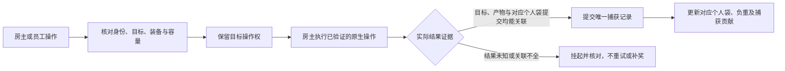

# 房主与员工模式

这是按用户提出的“房主掌主动权，第二人充当员工”确定的首版玩法方案。
房主带队潜水，员工提供捕鱼和搬运协作，长期进度归房主。
当前源码为0.1.22-dev、协议5，插件Build警告视为错误通过；Core输入本轮未改，复用0.1.21实际176/176结果，没有重跑测试。本文件区分玩法约定、CLR基础和待接游戏行为。
现有地图选择仅是候选，未实现地图采用、员工原生操作、独立工作背包或返航结算。

## 首版规则

- 房主选择潜水世界、入海、换层和返航，任务、图鉴、材料、经济与自动保存均由房主的原游戏处理。
- 员工使用自己的本机输入与镜头，计划拥有独立移动、氧气、受伤、鱼叉和弹药状态；装备先使用房主批准的固定配置。
- 按用户最新要求，每人有独立背包、独立容量和独立负重。房主统一管理数据，不共用一个容量上限。
  房主保留自己的原生`LootBox`；员工使用由房主持有的Mod会话工作袋，客机显示确认后的个人清单。
  员工袋是本次潜水有效的独立物料记录，不是房主袋的副本，也不是员工单机存档里的第二个`LootBox`。
- 每人容量来自房主批准的装备配置，品质、肉量、重量及超重规则由房主确认。
  例如两人各20kg时合计可携带40kg，一人负重不能拖慢另一个人；实际配置不固定为20kg。
  容量检查必须按操作人的袋执行，包括捕获前的检查，不能等物品添加时才换袋。
  满包/超重按各自已验证规则处理；初版先不开放两袋转移，独立丢弃也需确认。
- 先支持普通鱼和一套已验证武器，再扩展普通采集物、掉落物和工具。
  任务关键物、NPC、Boss及特殊捕获流程先由房主操作，逐条验证后开放给员工。
- 初期双方在同一场景/层活动，由房主带队换层。当前鱼来源只覆盖房主所在场景，
  不能默认员工独自进入其他层仍有完整鱼群；自由跨层需另外扩展房主多场景模拟和实体来源。
- 员工退出后恢复自己的单机状态，其个人存档、装备、图鉴和剧情不接收这次房主收益。
  隔离必须覆盖所有自动写入路径，不能只屏蔽最终保存文件或某一个保存方法。

## 权责

| 项目 | 房主 | 员工 |
| --- | --- | --- |
| 世界、换层、潜水阶段 | 唯一裁定，决定入海和返航 | 跟随共同阶段，发送操作意图 |
| 移动、瞄准、镜头 | 本地控制自己，并核对员工状态 | 本机独立操作，显示确认/纠正 |
| 装备、氧气、HP、冷却 | 保存两人的独立会话状态，批准固定装备 | 使用自己的临时状态，不借房主单例角色 |
| 鱼AI、伤害、捕获、拾取 | 运行实际世界，统一处理两人的竞争 | 显示结果，不自行奖励或运行另一份鱼AI |
| 背包、重量、品质、数量 | 原生房主袋和权威员工袋分别记账，按人发布容量/负重 | 独立工作袋和个人负重，查看确认结果 |
| 任务、图鉴、仓库、金币 | 沿已验证的原生链推进房主进度 | 查看房主阶段，不独立推进或写个人进度 |
| 返航、结算 | 开始屏障，两袋分别确认入同一房主仓库/保存 | 接受共同返航，恢复个人单机状态 |

当前远程角色仅有显示组件，不能直接参与碰撞、受击或发射鱼叉。
员工模式简化持久进度；第二玩家、独立背包、武器、命中代理及生存状态仍需真正实现。

## 把抓到的东西关联起来

以下身份和字段是设计要求。0.1.15-dev开始实现独立的纯CLR账本，尚未接入协议5或游戏潜水生命周期。

| 记录 | 关联内容 | 用途 |
| --- | --- | --- |
| 潜水记录`ExpeditionId` | 房主生成；覆盖本次潜水及其多个场景、网络连接片段 | 换层/员工断线不能清空已入袋记录 |
| 员工记录`MemberId` | 房主签发的本次潜水成员身份，不等于昵称或固定玩家2 | 新连接不自动继承旧员工的未决操作 |
| 操作记录 | 连接Room、握手玩家身份、RequestId/OperationId、目标epoch/EntityId | 关联意图、原生执行和实际物品结果 |
| 捕获/拾取记录`CaptureId` | 原目标身份、操作、房主确认的物料结果 | 两人同时抓同一来源、重复消息仍只有一笔 |
| 物料记录 | 真实TID、品质、数量、重量、OwnerMemberId、捕获人/协助者 | 肉量与品质取房主确认结果，不采信客机报价 |
| 个人袋修订`BagRevision` | 每个Member独立修订，记录入袋、丢弃、容量与超重状态 | 个人显示和权威袋一致，丢弃也需确认 |
| 返航记录`ReturnId` | 潜水记录、分别冻结的两袋清单、每条物料的入仓状态 | 原生已转移条目不重复写；员工未转移条目由新桥一次入仓 |

鱼的TID是物种，不是独立鱼身份。同一物种两条鱼分别记账；同一鱼的鱼叉、QTE和拾取回调不能各算一次。
一个来源可能产生多个物料条目，采用一个捕获事务加多个真实结果，不能把整条鱼、肉块与附加掉落分别重复兑奖。
场景卸载、池回收、镜头隐藏及预览消失都不是入袋证据。
房主原生目标复核仍需本地生命周期代次，原生指针/包装器不跨网络。
确实看到房主袋增加但无法强关联来源时，记录“未归属原生袋增量”，不要据此再复制进员工袋。
员工袋提交需关联完整产物、操作、实际分流与捕获终态，不按物种/时间接近猜归属或贡献。

## 捕获事务

容量预约按Member执行，只是Mod内部并发计划。对应个人袋仍可能变化，执行前和实际提交后都要重查，
房主本地操作也必须进入同一竞争路径；只去重员工请求不能防止房主原生操作同时提交。
鱼叉发射、QTE胜利、原方法返回`true`、鱼被移除、入袋与入仓是不同阶段。
捕获账本必须关联真实目标/操作、房主确认的完整产物和对应个人袋的提交，不能看到任一单独标记便奖励。

房主捕获采用`HostNativeBagReceipt`，确认自己的原生袋实际增加。
员工捕获采用`EmployeeBagReceipt`：在已验证的产物产生/入袋边界，原子加入房主持有的员工袋，
确认这批产物没有同时写进房主原生袋，并确认捕获终态。不能先加房主袋再复制/扣减，
否则会污染房主负重、意外或重复触发任务/图鉴，或在异常时重复物品。
只拦截`LootBox.Add`也不够：更早的容量检查、负重限制及嵌套/异步调用都必须有相同的员工操作归属。
不临时抬高房主容量，不借`AddIgnoreOverloaded`冒充员工容量检查，也不向原调用随意返回假成功。

未来桥接的产物、容量路由、入袋分流及员工入仓事实能力默认不可用。只读日志或合成CLR测试不能开启实际奖励权限。
进入原生操作后结果不确定，保留操作和目标屏障；重复请求查原记录，不重新调用伤害/拾取或补发物品。
重启恢复首先核对真实游戏状态，不根据缺少Mod日志推断“原生未提交”。

## 原游戏入口与验证点

来自本机已生成的互操作元数据，不是已验证的完整调用链。

| 阶段 | 已发现入口 | 必须确认 |
| --- | --- | --- |
| 鱼捕获/拾取 | `FishAISystem.SuccessPickupFish`、`FishInteractionBody.SuccessInteract` | 目标、品质/肉量、原生提交与对象池回收顺序 |
| 房主袋与员工分流 | `LootBox.Add` / `Add_Impl`、袋槽、重量/超重成员 | 原参数含义、产物生成、按人容量、分流与嵌套/异步调用 |
| 图鉴/捕获进度 | `SaveDataCaughtFishRouter.AddCaughtFish` | 写入时刻、重复计数、捕获阶段自动持久化 |
| 返航入仓 | `IngredientsStorage.AddFromLootBox`、`LootBoxSlot.GetExchangeCount` | 房主原袋原链、员工新增适配、品质/数量转换、真实净增加与保存完成 |
| 其他拾取 | `PickupInstanceItem.SuccessInteract` / `OnStoredItem` | 物料类别、任务/金币副作用及唯一来源身份 |

袋槽的ID/Grade/FinalGrade/TotalCount存在`ObscuredInt`字段；不猜内部加密布局或自行解释参数序号。
已确认生成的`LootBox.weight/weightMax/m_Box/AllBoxSlots`属性getter会调用原生方法；不能把它们当成直接字段读取。
重量直接字段候选为`_weight_k__BackingField`，容量字段为`m_WeightMax`；实际稳定读取、袋槽标识、嵌套添加及任务写入仍须实测。
`MissionManager.UpdateMissionIntCondition`存在按物料/品质/数量更新的入口；任务可能在水下变化，不能假设全部进度等返航才写。
鱼的`GetDropItemID`参数是tier，不是grade；产物可能有追加随机掉落，不能拿原鱼TID猜肉量、重复随机或补roll。
`LootBoxSlot`没有已发现的(id,count,grade)便利构造；员工入仓需验证真实槽/转换规则，不假设直接AddIngredients等价。
`CommitDiveLootDataOnlyJungle`是专项入口，不能作为普通海洋返航；普通返航的调用与保存顺序仍待实机。
0.1.11已观察Fire/Hook/Damage，未见Win/Pickup；0.1.12目标检查只读，不能证明入袋或收益已接通。

## 返航和退出

原GameAssembly离线分析补定位：`AddDropItem_Impl`包含袋Add/IgnoreOverloaded及
`AddLootingSaveData`目标，容量与持久副作用必须随员工产物一起分流。
`AddFromLootBox`的关联代码有六参数IngredientsStorage.Add目标，普通返航还分鱼卵、
采集物、关键物品、种子与装饰路径；不能仅一个入仓回调代表整个背包。
保存/加载基类包含文件写/复制/删除等目标，SetLoadedData也含同步；不能当纯恢复接口。
这些是静态目标，不证明分支、增量或保存；复现及下一接入点见[NATIVE_ANALYSIS](NATIVE_ANALYSIS.md)。

- 房主开始正常返航后停止新操作，冻结已确认入袋清单，处理已进入原生的未决操作。
  只有证据充分才标记完成；结果未知不自动重试、退款、回滚库存或重复结算。
- 房主原生袋让原游戏按已验证的链入仓和保存，不能按CaptureId给这一袋重复Add。
  员工袋尚未写入原生仓库，需要新的返航适配，按唯一物料/批次一次转入房主仓库并核对实际增加。
  入仓过程中区分Pending/NativeEntered/StorageObserved/SaveConfirmed；未知结果不再次写入。
  按ReturnId/CaptureId/ProductIndex记录每个产物，部分成功不能重放整批；原生保存与Mod日志没有共同事务保证，跨崩溃未知条目保留待核对。
  不在水下把员工袋塞进房主袋挤占容量；汇总发生在返航入仓阶段。
- 员工断线不撤销已确认员工袋。它仍由房主本次潜水账本持有，按既定正常返航规则入仓。
  未开始的员工操作取消；已开始的结果继续由房主核对。
  潜水账本由房主潜水生命周期持有，不放入随`NetworkController.Disconnect`清空的房间对象。
- 房主中途退出、崩溃或没有返航，不冒充正常结算；依照原游戏可核对恢复，不自动重放奖励。
  首版不承诺跨进程重连续跑或自动恢复未知事务，新连接的玩家2/同昵称不能自动继承旧员工操作权。
- 客机进入前保存临时状态基线，退出时清自己的代理/临时UI并恢复单机状态。
  自动保存、图鉴、任务、仓库、IGP临时/长期数据等路径要共同隔离和验证，未隔离不能开放正式员工玩法。

## 实现顺序与验收

1. 固定房主/员工角色、批准装备、独立袋与退出规则，定位并验证客机临时进度及所有持久副作用隔离。
2. 验证地图原生来源与跨机标识，采用房主选择并隔离客机鱼生成/AI；同层入场后再授予玩法权限。
3. 建员工独立actor、位置、装备、氧气/HP和投射物状态；原生入口若暗用房主Player/当前武器，不直接作为员工执行桥。
4. 只读关联普通鱼产物、原生容量检查、入袋及正常入仓路径；建立按Member的CLR个人袋、捕获账本与容量预约。
5. 验证员工产物完整分流且不影响房主原袋、重量和自动写入；接一个已验证武器和普通鱼，同一目标只进一个人的袋。
6. 接员工袋原生入仓桥，分别验证两人容量/负重、正常返航汇总仅一次、员工断线保留已确认袋、未知结果不重派发及客机恢复。
7. 完成真实双游戏闭环后扩展采集/掉落/关键物；两袋转移、员工持久报酬和自由跨层属于后续阶段。

源码/协议准备不等于上述玩法通过。当前实机验证延后、默认发行包0.1.0，真实双游戏与员工模式尚未验收。

## 0.1.15-dev 的实现边界

新增`Core/Cargo`个人账本：两位成员分别拥有容量、重量、预约重量、袋修订与请求高水位。
来源与操作、捕获人及完整产物指纹关联；过期事实、重复来源、不同操作或产物替换不能直接确认入袋。
房主袋重量取可信原生总重量，不再重复加产物重量；员工袋只累加自己确认的物料。
本模块只接受房主已经核实完整产物的候选计划，原生随机产物尚不明确时不能建计划、猜肉量或再次随机。

进入执行后未知结果保留来源与预约，不因超时、换场景或员工断线重新派发。
返航冻结后停止新预约；房主袋只能观察原生入仓，不可领取新增物品的派发租约。
员工袋每个`CaptureId/ProductIndex`单独记录入仓阶段，部分成功不会重放整批；保存确认仍是独立步骤。
该账本是内存模型，尚无游戏生命周期、网络清单、持久事务或原生分流/入仓桥；真实玩法能力仍关闭。
当前来源Room首次预约后绑定；没有已验证的来源迁移，新Room不能重编号绕过未决来源。
跨scene epoch仍有未决预约/执行时保留保守屏障，原操作迟到的真实结果可核对，不重派发。
快照仅列跟踪捕获，房主原有货物未完整枚举，`NativeBagInventoryComplete=false`。
`CompleteReturn`只表示跟踪条目的闭环；返航阶段的Member.Inventory/Weight为审计视图，逐项状态以ReturnItems为准，不能直接作为实时袋或负重UI。

F11新增默认关闭的`Observe loot and return calls (read-only)`，独立于TCP和鱼观察开关。
观察四处自然调用：鱼`AddDropItem_Impl`、袋`LootBox.Add`、图鉴`AddCaughtFish(int,int,bool)`、
仓库`IngredientsStorage.AddFromLootBox`；每处前后记录同一个CallId，原参数和返回值保留。
Unity线程内即时复制参数及袋重量/容量直接字段，只排队CLR值，消费日志时不再读取原生对象。
鱼来源仅在鱼产物入口prefix冻结候选身份；嵌套的袋、图鉴或仓库调用不会按时间/线程推测所属鱼或员工。
槽位加密字段和返航转换数量暂不读取，`ActualBagDeltaProven/SourceOperationBound/CaptureSuccess/StorageDeltaProven`始终false。

观察限额按全进程累计1024条前后事件，队列64、待配对上下文128、每Update消费16。
关闭或Disconnect只移除自己的挂钩并清诊断队列，统计与错误锁存不因重开归零；队列丢失或停止时丢弃要计数，日志不是完整链保证。
新版编译和纯CLR测试结果见[独立背包构建摘要](../logs/cargo-ledger-build-verification.json)。
目前未部署或启动0.1.15，四处挂钩的原生ABI、实际读取与完整捕获/正常返航均待实机。

## 0.1.17 当前接线与下一桥

0.1.17 将当前固定来源 CLR 清单接入候选发送：建房时记录实际 Run/owner floor，建房前 entry、退休 Run/owner/controller 和旧回调不能提供新来源。集合删除或替换先退休旧 wire 代次再重发，每帧最多 8 条选择；诊断队列消费不影响当前清单。旧 Observe map selection calls 仅诊断，其关闭或丢失不发送/撤销来源。

新增 6 组 Core 快照和 6 组实际回环 TCP 适配测试，原 4 项源适配已迁移，总计 160/160 通过；Build 警告视为错误通过。测试使用合成标量，不运行 NativeHooks、NativeCapture、Unity provider 或两个游戏。NativeGenerationBound、HostSelectionApplied、GuestStateIsolated、WorldAuthority、CargoAuthority 仍为 false；未部署或启动。

当前行为见[固定来源候选传输](ORIGIN_MAP_TRANSPORT.md)和[0.1.17 构建摘要](../logs/origin-map-transport-build-verification.json)。0.1.14 的 callbackFloor/cache 来源与 0.1.16 的“仅日志”是历史范围，当前发送流程按新文档执行。

客机的原生 Serialize/Deserialize、双 Data/Interaction 根及直接恢复候选已离线定位，见[客机影子桥研究](GUEST_ISOLATION.md)。SaveData(string ver) 不是 JSON 构造器，SetLoadedData/Load 不是纯交换；旧协程、缓存、可变子树及全部持久输出仍需隔离与恢复验证。尚未执行原生克隆/根替换或证明 GuestStateIsolated。每人的独立容量和负重规则保持不变。

## 0.1.18 原生根桥与输出围栏源码

0.1.18新增实际typed原生影子桥、单次事务及已枚举输出围栏源码。四类Data原生JSON round trip、五根直接交换/回读/恢复和15个独立强handle已编译；7组新增事务夹具以合成backend验证partial/unknown补偿、fence/refs保留和一次清理，总167/167通过。

当前生产进入与静止边界恒false，事务在围栏安装前拒绝；startup primitive自身再查边界，未接Network/GUI，未运行克隆、根交换、阻断或恢复。194条精确声明不是所有writer、独立native地址或ABI证明；Interaction未Sync、完整子树/旧缓存/协程隔离仍待完成。全部GuestStateIsolated/NativePermission/WorldAuthority/CargoAuthority保持false，未部署或启动。

实现与下一步见[原生根桥](GUEST_SHADOW_BRIDGE.md)、[输出围栏](GUEST_OUTPUT_FENCE.md)及[0.1.18构建摘要](../logs/guest-shadow-build-verification.json)。下一步必须实现可信原生进入/静止边界与缓存/Interaction切换，再进行受控实机验证；个人袋分流、真实地图采用及双游戏闭环仍按原计划推进。

0.1.19版交互准备只补客机临时状态基础，未开放员工捕获/入仓权限；每人独立容量和负重、房主原袋不重复Add、员工逐产物结算规则保持。完整缓存及旧引用边界见[GUEST_RUNTIME_CACHES](GUEST_RUNTIME_CACHES.md)。

0.1.20 已将[独立食材缓存准备/恢复](GUEST_INGREDIENT_CACHE.md)接入第六步源码，174项测试仅覆盖CLR控制及此前范围；[当前摘要](../logs/guest-ingredient-cache-build-verification.json)不证明原生运行。每人独立容量/负重及房主唯一长期收益规则保持；完整资源、缓存、真实地图、捕鱼分流、返航和双游戏仍待验收。

0.1.21 增加第七[Ingame缓存](GUEST_INGAME_CACHE.md)，[API](GUEST_INGAME_API.md)核对六类记录及mutable子图。非空SubHelperSpecData和live gearQueue未支持时拒绝，不分享、不改空。三known原图在Serialize前闭合，准备后strict复查；七步按7→6→Save5恢复，21explicit handles/4Data stamps，第七singlefield无Mixed。176项Core仅控制证据，[本轮摘要](../logs/guest-ingame-cache-build-verification.json)的插件构建警告视为错误通过，native候选未执行。

临时缓存副本不提供员工装备、工具、背包或捕获权限；entry/quiet/native/guest/world/bag仍false。每人的独立容量、重量与负重不变，房主原袋不补Add、员工未入仓产物须逐项真实确认。完整资源/actor/其它缓存/输出、房主地图采用、个人捕获与正常返航、实际双端/冷配置和M3—M7仍待完成。

## 0.1.22 comparer 源码不代替员工玩法

[独立字典comparer](GUEST_DICTIONARY_COMPARERS.md)与[接口](GUEST_COMPARER_API.md)仅补缓存准备。int/string/InGameSaveType(int32)三key的精确Generic/Object与该enum专用Enum候选同class独立复制；source pointer/class/kind及aux审计、null原Capture后Prepare拒绝同样约束Ingredients。不调用Default/CreateComparer/getter，不共享、清空或改成其它语义；custom/文化/hash-salt未知拒。新表显式(capacity,comparer)后才Add；constructor抛时assignment未发生，PartialConstructorAllocationRetentionVerified=false，不表示全部未知allocation已持有。

七步/21explicit handles/4Data stamps不扩，全ABI/fullisolation/entry/quiet/native/guest/world/bag权限false，无Network/GUI自动native调用。[当前摘要](../logs/guest-comparer-build-verification.json)的Build警告视为错误通过；Core未改，复用0.1.21实际176/176，未重跑。[冷档候选](GUEST_COLD_PROFILE.md)仅研究首load、slot和输出，未采用。每人独立袋/容量/重量/负重、房主唯一长期收益、房主原袋不补Add及员工逐产物返航保持；资源/actor/cache/output、房主地图、个人真实捕获、双端/冷配置和M3—M7仍待验收。
