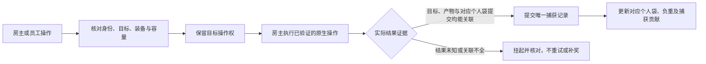

# 房主与员工模式

这是按用户提出的“房主掌主动权，第二人充当员工”确定的首版玩法方案。
房主带队潜水，员工提供捕鱼和搬运协作，长期进度归房主。
当前源码仍为0.1.14-dev、协议5、134项CLR/TCP测试通过；本文件描述待实现行为。
现有地图选择仅是候选，未实现地图采用、员工原生操作、独立工作背包或返航结算。

## 首版规则

- 房主选择潜水世界、入海、换层和返航，任务、图鉴、材料、经济与自动保存均由房主的原游戏处理。
- 员工使用自己的本机输入与镜头，计划拥有独立移动、氧气、受伤、鱼叉和弹药状态；装备先使用房主批准的固定配置。
- 按用户最新要求，每人有独立背包、独立容量和独立负重。房主统一管理数据，不共用一个容量上限。
  房主保留自己的原生`LootBox`；员工使用由房主持有的Mod会话工作袋，客机显示确认后的个人清单。
  员工袋是本次潜水有效的独立物料记录，不是房主袋的副本，也不是员工单机存档里的第二个`LootBox`。
- 每人容量来自房主批准的装备配置，品质、肉量、重量及超重规则由房主确认。
  例如两人各20kg时合计可携带40kg，一人负重不能拖慢另一个人；实际配置不固定为20kg。
  容量检查必须按操作人的袋执行，包括捕获前的检查，不能等物品添加时才换袋。
  满包/超重按各自已验证规则处理；初版先不开放两袋转移，独立丢弃也需确认。
- 先支持普通鱼和一套已验证武器，再扩展普通采集物、掉落物和工具。
  任务关键物、NPC、Boss及特殊捕获流程先由房主操作，逐条验证后开放给员工。
- 初期双方在同一场景/层活动，由房主带队换层。当前鱼来源只覆盖房主所在场景，
  不能默认员工独自进入其他层仍有完整鱼群；自由跨层需另外扩展房主多场景模拟和实体来源。
- 员工退出后恢复自己的单机状态，其个人存档、装备、图鉴和剧情不接收这次房主收益。
  隔离必须覆盖所有自动写入路径，不能只屏蔽最终保存文件或某一个保存方法。

## 权责

| 项目 | 房主 | 员工 |
| --- | --- | --- |
| 世界、换层、潜水阶段 | 唯一裁定，决定入海和返航 | 跟随共同阶段，发送操作意图 |
| 移动、瞄准、镜头 | 本地控制自己，并核对员工状态 | 本机独立操作，显示确认/纠正 |
| 装备、氧气、HP、冷却 | 保存两人的独立会话状态，批准固定装备 | 使用自己的临时状态，不借房主单例角色 |
| 鱼AI、伤害、捕获、拾取 | 运行实际世界，统一处理两人的竞争 | 显示结果，不自行奖励或运行另一份鱼AI |
| 背包、重量、品质、数量 | 原生房主袋和权威员工袋分别记账，按人发布容量/负重 | 独立工作袋和个人负重，查看确认结果 |
| 任务、图鉴、仓库、金币 | 沿已验证的原生链推进房主进度 | 查看房主阶段，不独立推进或写个人进度 |
| 返航、结算 | 开始屏障，两袋分别确认入同一房主仓库/保存 | 接受共同返航，恢复个人单机状态 |

当前远程角色仅有显示组件，不能直接参与碰撞、受击或发射鱼叉。
员工模式简化持久进度；第二玩家、独立背包、武器、命中代理及生存状态仍需真正实现。

## 把抓到的东西关联起来

以下身份和字段是设计要求，还未加入0.1.14协议。

| 记录 | 关联内容 | 用途 |
| --- | --- | --- |
| 潜水记录`ExpeditionId` | 房主生成；覆盖本次潜水及其多个场景、网络连接片段 | 换层/员工断线不能清空已入袋记录 |
| 员工记录`MemberId` | 房主签发的本次潜水成员身份，不等于昵称或固定玩家2 | 新连接不自动继承旧员工的未决操作 |
| 操作记录 | 连接Room、握手玩家身份、RequestId/OperationId、目标epoch/EntityId | 关联意图、原生执行和实际物品结果 |
| 捕获/拾取记录`CaptureId` | 原目标身份、操作、房主确认的物料结果 | 两人同时抓同一来源、重复消息仍只有一笔 |
| 物料记录 | 真实TID、品质、数量、重量、OwnerMemberId、捕获人/协助者 | 肉量与品质取房主确认结果，不采信客机报价 |
| 个人袋修订`BagRevision` | 每个Member独立修订，记录入袋、丢弃、容量与超重状态 | 个人显示和权威袋一致，丢弃也需确认 |
| 返航记录`ReturnId` | 潜水记录、分别冻结的两袋清单、每条物料的入仓状态 | 原生已转移条目不重复写；员工未转移条目由新桥一次入仓 |

鱼的TID是物种，不是独立鱼身份。同一物种两条鱼分别记账；同一鱼的鱼叉、QTE和拾取回调不能各算一次。
一个来源可能产生多个物料条目，采用一个捕获事务加多个真实结果，不能把整条鱼、肉块与附加掉落分别重复兑奖。
场景卸载、池回收、镜头隐藏及预览消失都不是入袋证据。
房主原生目标复核仍需本地生命周期代次，原生指针/包装器不跨网络。
确实看到房主袋增加但无法强关联来源时，记录“未归属原生袋增量”，不要据此再复制进员工袋。
员工袋提交需关联完整产物、操作、实际分流与捕获终态，不按物种/时间接近猜归属或贡献。

## 捕获事务

容量预约按Member执行，只是Mod内部并发计划。对应个人袋仍可能变化，执行前和实际提交后都要重查，
房主本地操作也必须进入同一竞争路径；只去重员工请求不能防止房主原生操作同时提交。
鱼叉发射、QTE胜利、原方法返回`true`、鱼被移除、入袋与入仓是不同阶段。
捕获账本必须关联真实目标/操作、房主确认的完整产物和对应个人袋的提交，不能看到任一单独标记便奖励。

房主捕获采用`HostNativeBagReceipt`，确认自己的原生袋实际增加。
员工捕获采用`EmployeeBagReceipt`：在已验证的产物产生/入袋边界，原子加入房主持有的员工袋，
确认这批产物没有同时写进房主原生袋，并确认捕获终态。不能先加房主袋再复制/扣减，
否则会污染房主负重、意外或重复触发任务/图鉴，或在异常时重复物品。
只拦截`LootBox.Add`也不够：更早的容量检查、负重限制及嵌套/异步调用都必须有相同的员工操作归属。
不临时抬高房主容量，不借`AddIgnoreOverloaded`冒充员工容量检查，也不向原调用随意返回假成功。

未来桥接的产物、容量路由、入袋分流及员工入仓事实能力默认不可用。只读日志或合成CLR测试不能开启实际奖励权限。
进入原生操作后结果不确定，保留操作和目标屏障；重复请求查原记录，不重新调用伤害/拾取或补发物品。
重启恢复首先核对真实游戏状态，不根据缺少Mod日志推断“原生未提交”。

## 原游戏入口与验证点

来自本机已生成的互操作元数据，不是已验证的完整调用链。

| 阶段 | 已发现入口 | 必须确认 |
| --- | --- | --- |
| 鱼捕获/拾取 | `FishAISystem.SuccessPickupFish`、`FishInteractionBody.SuccessInteract` | 目标、品质/肉量、原生提交与对象池回收顺序 |
| 房主袋与员工分流 | `LootBox.Add` / `Add_Impl`、袋槽、重量/超重成员 | 原参数含义、产物生成、按人容量、分流与嵌套/异步调用 |
| 图鉴/捕获进度 | `SaveDataCaughtFishRouter.AddCaughtFish` | 写入时刻、重复计数、捕获阶段自动持久化 |
| 返航入仓 | `IngredientsStorage.AddFromLootBox`、`LootBoxSlot.GetExchangeCount` | 房主原袋原链、员工新增适配、品质/数量转换、真实净增加与保存完成 |
| 其他拾取 | `PickupInstanceItem.SuccessInteract` / `OnStoredItem` | 物料类别、任务/金币副作用及唯一来源身份 |

袋槽的ID/Grade/FinalGrade/TotalCount存在`ObscuredInt`字段；不猜内部加密布局或自行解释参数序号。
已确认生成的`LootBox.weight/weightMax/m_Box/AllBoxSlots`属性getter会调用原生方法；不能把它们当成直接字段读取。
重量直接字段候选为`_weight_k__BackingField`，容量字段为`m_WeightMax`；实际稳定读取、袋槽标识、嵌套添加及任务写入仍须实测。
`MissionManager.UpdateMissionIntCondition`存在按物料/品质/数量更新的入口；任务可能在水下变化，不能假设全部进度等返航才写。
鱼的`GetDropItemID`参数是tier，不是grade；产物可能有追加随机掉落，不能拿原鱼TID猜肉量、重复随机或补roll。
`LootBoxSlot`没有已发现的(id,count,grade)便利构造；员工入仓需验证真实槽/转换规则，不假设直接AddIngredients等价。
`CommitDiveLootDataOnlyJungle`是专项入口，不能作为普通海洋返航；普通返航的调用与保存顺序仍待实机。
0.1.11已观察Fire/Hook/Damage，未见Win/Pickup；0.1.12目标检查只读，不能证明入袋或收益已接通。

## 返航和退出

- 房主开始正常返航后停止新操作，冻结已确认入袋清单，处理已进入原生的未决操作。
  只有证据充分才标记完成；结果未知不自动重试、退款、回滚库存或重复结算。
- 房主原生袋让原游戏按已验证的链入仓和保存，不能按CaptureId给这一袋重复Add。
  员工袋尚未写入原生仓库，需要新的返航适配，按唯一物料/批次一次转入房主仓库并核对实际增加。
  入仓过程中区分Pending/NativeEntered/StorageObserved/SaveConfirmed；未知结果不再次写入。
  按ReturnId/CaptureId/ProductIndex记录每个产物，部分成功不能重放整批；原生保存与Mod日志没有共同事务保证，跨崩溃未知条目保留待核对。
  不在水下把员工袋塞进房主袋挤占容量；汇总发生在返航入仓阶段。
- 员工断线不撤销已确认员工袋。它仍由房主本次潜水账本持有，按既定正常返航规则入仓。
  未开始的员工操作取消；已开始的结果继续由房主核对。
  潜水账本由房主潜水生命周期持有，不放入随`NetworkController.Disconnect`清空的房间对象。
- 房主中途退出、崩溃或没有返航，不冒充正常结算；依照原游戏可核对恢复，不自动重放奖励。
  首版不承诺跨进程重连续跑或自动恢复未知事务，新连接的玩家2/同昵称不能自动继承旧员工操作权。
- 客机进入前保存临时状态基线，退出时清自己的代理/临时UI并恢复单机状态。
  自动保存、图鉴、任务、仓库、IGP临时/长期数据等路径要共同隔离和验证，未隔离不能开放正式员工玩法。

## 实现顺序与验收

1. 固定房主/员工角色、批准装备、独立袋与退出规则，定位并验证客机临时进度及所有持久副作用隔离。
2. 验证地图原生来源与跨机标识，采用房主选择并隔离客机鱼生成/AI；同层入场后再授予玩法权限。
3. 建员工独立actor、位置、装备、氧气/HP和投射物状态；原生入口若暗用房主Player/当前武器，不直接作为员工执行桥。
4. 只读关联普通鱼产物、原生容量检查、入袋及正常入仓路径；建立按Member的CLR个人袋、捕获账本与容量预约。
5. 验证员工产物完整分流且不影响房主原袋、重量和自动写入；接一个已验证武器和普通鱼，同一目标只进一个人的袋。
6. 接员工袋原生入仓桥，分别验证两人容量/负重、正常返航汇总仅一次、员工断线保留已确认袋、未知结果不重派发及客机恢复。
7. 完成真实双游戏闭环后扩展采集/掉落/关键物；两袋转移、员工持久报酬和自由跨层属于后续阶段。

源码/协议准备不等于上述玩法通过。当前实机验证延后、默认发行包0.1.0，真实双游戏与员工模式尚未验收。
