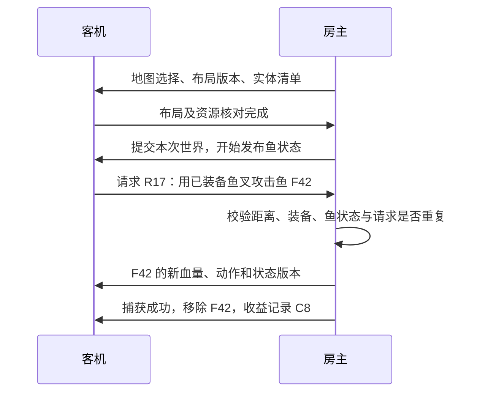

# 同一海洋、鱼与互动

对应 PLAN 的 M4、M5 和 M6。这里区分设计、已确认的接口签名和待实机验证的行为。
已验证第二角色本地回放；0.1.5-dev 在真实潜水中运行只读鱼探针、经本机 TCP 传输实际鱼清单并执行单鱼显示组件。
0.1.7-dev 用户确认鱼可见但镜头内突然消失，日志记录角色部件销毁导致自动断开。
0.1.8-dev 没有旧异常，但用户确认标签换鱼及继续消失。0.1.9-dev 锁定身份并部署；用户确认稳定性通过，断开/返航及两游戏验收待完成，核心共 62 项通过。
这些证据不证明两个游戏拥有同一地图、同一条鱼或共同捕获结果。

## 世界由房主裁定

房主运行原游戏的鱼 AI、生成、伤害和收益逻辑。客机显示房主发布的状态，
发出操作请求；房主校验后决定结果。独立服务器方案仍暂缓。
这种权责划分参考 Unity 的
[NetworkObject 身份和生成权限说明](https://mp-docs.dl.it.unity3d.com/netcode/1.10.0/basics/networkobject/)，
本项目采用自己的 IL2CPP 适配和协议，尚未安装或集成 Unity Netcode。

同步随机种子只能作为生成的一部分。两进程的加载、随机调用、鱼 AI、
玩家操作与存档条件可能不同；需要同步实际选择和最终结果，并检查布局。

## 第一层：地图选择与入海屏障

1. 建房握手后，在客机执行随机选择和异步资源加载前，接收房主的潜水场景、
   日夜条件、IGP 组和动态节点选择。生成种子可随清单发送，但不作为一致性的唯一证据。
2. 节点使用已验证稳定的地址/节点标识；路径与兄弟序号只能作为候选，
   必须检查重复、跨存档差异与两机稳定性。节点绑定有歧义时停止入场。
3. 客机从自己的游戏资源加载相同选择。未加载完成时缓冲有界消息，
   不在加载后直接改字段并假定旧地形已被替换。
4. 读取最终碰撞几何和布局清单，双方确认后由房主提交世界 epoch。
   当前 WorldLayoutReader 只完成核对框架，不会主动统一选择。
5. 切换场景、更换地图或断线时清空旧 epoch 的绑定、帧和操作请求。
   同名场景不代表相同海洋；不一致时不进入合作状态。

地图选择可能读取临时潜水数据或长期存档。接管之前必须实测哪些路径会写入进度，
建立客机临时状态和退出恢复流程，不复制房主整个存档来实现地图一致。

## 第二层：实体身份与鱼状态

- 实体身份为会话 RoomId + 世界 epoch + 房主分配的递增 EntityId。
  鱼种 TID 是种类；同种两条鱼要有不同 EntityId。
  Unity 实例 ID、内存指针和本地对象路径只用于本机诊断。
- 初始清单记录鱼种/生成资源、位置、显示方式和状态版本。
  分块传输带数量、总大小与完成校验；客机完整应用后确认，期间不接受互动。
- 初始完整状态与后续事件必须有一致的版本顺序，处理清单生成期间的新增和死亡。
  不能先接到“移除鱼”后又被旧清单复活。对象池再启用时应分配新身份或新生成代次。
- 移动和动画使用有界批次快照与插值；生成、死亡、捕获和拾取使用有序事件。
  暂定普通鱼状态 10～15Hz，最终频率、批次大小和流量以实测为准。
- 客机对应对象停用自主 AI、随机再生成和独立奖励/伤害路径。
  还要处理 Animator 根运动、群游 Job、协程与刚体，单独关闭一个组件未必足够。
  接管对象时记录本 Mod 改动，退出时恢复；避免批量停用包含玩家/地形的父节点。
- 先验证一条普通鱼；确定资源加载和副作用后再扩大到整片海洋。
  SpriteRenderer 的角色显示方案不自动覆盖 Spine/Mesh 鱼及其互动碰撞体。

## 第三层：攻击、鱼叉、拾取与结算

客机请求携带请求 ID、epoch、目标 EntityId、动作种类、装备槽及操作时刻。
房主从已确认的玩家/装备状态计算伤害，不采用客机直接上报的伤害数或掉落数。
验证目标存活、攻击范围、冷却、动作条件及合法时刻；延迟补偿需要有界历史和明确时间窗口。
请求结果缓存并去重，同时拾取同一条鱼只有一个已提交结果。

鱼叉挂钩、QTE、拖拽和回收是多阶段动作，需要房主发放绑定/操作权，
客机先播放即时视觉反馈，再接受房主确认或回滚。确认流程不能阻塞网络线程。
先做普通鱼的伤害/捕获，再扩展大鱼、切割与特殊工具。

房主原生的 AI 可能只认识单个 PlayerCharacter。当前远程角色只有显示组件，
无法直接作为鱼攻击目标或接收碰撞伤害。需要单独验证第二玩家的目标选择、
命中代理、氧气/受伤状态及反击；不能把“鱼跟随同一路径”视为已能对两位玩家作出响应。

收益记入带唯一捕获 ID 的会话账本，由房主统一返航结算。客机只展示临时清单，
其存档写入和原游戏自动保存入口需要隔离及恢复验证。正常退出、断线和异常退出均要验收。

## 本机已确认的接口签名

Steam Build 25315876 / Unity 6000.0.52f1，读取 BepInEx 生成的互操作元数据。
这些是可研究的入口；封装方法体不能证明游戏原始控制流或安全挂钩位置。

| 需求 | 已读到的成员 | 下一步实测 |
| --- | --- | --- |
| 地图节点 | DynamicIngameNodeLoader.UniqueID / addressablePrefabName / lastSelectedData / GetSelectedAddressableName | ID 是否稳定；选取与 Init/异步加载顺序；空地址是否只是加载中 |
| IGP 组选择 | IGPSetController.CurrIGPSetInfo / CurrIGPSet / GetRandomIGPSetInfo，IGPSetInfo.prefabName / LoadPrefab | 组是否包含地形/实体；接管选择是否写临时或长期数据 |
| 鱼生成 | InGameManager.FishAllocators，FishAllocator.Spawn(bool) / OnSpawnedInstance / GetInstancedFishs | 延迟生成、Despawn、对象池与群游生成时机 |
| 鱼身份与血量 | DR.AI.FishAISystem.FishDataTID / HP / MaxHP / IsFishCaptured / FishDamageable | 初始化前读值、死亡/捕获/回收的生命周期和 HP 变化 |
| 停止本地逻辑 | FishAISystem.AddFishStopReason / RemoveFishStopReason / SetRootMotionStopped，BehaviorControlFlag，FishBehaviorTree | 停止原因所有权、物理/群游/协程是否仍运行及恢复副作用 |
| 伤害 | Damageable.TakeDamage(AttackData)，SABaseFishSystem.OnTakeDamage / OnDie，Damager.GetAttackData | 真正裁定点、调用链、重复奖励及原生异常路径 |
| 鱼叉与捕获 | CatchableObject.HookedByProjectile / WinFromProjectileinFight / SetDieState | 鱼叉绑定、QTE、捕获记账及销毁顺序 |
| 拾取 | FishInteractionBody.SuccessInteract / SuccessPickupFish，PickupInstanceItem.SuccessInteract / OnStoredItem | 权限与收益在哪一层提交、两人竞争时的原子操作 |
| 临时进度 | IngameSaveDataManager.SaveInGameData / GetInGameData | 适用的数据类型和客机退出恢复；尚未调用写入方法 |

可复现签名研究：`development/scripts/Inspect-WorldApi.ps1`。
报告保存到忽略的 `.local/analysis/world-api.json`，不发布游戏程序集或完整机器记录。

## 地图加载前入口研究

四份历史世界日志共 173 条快照、0 个探针错误，DynamicIngameNodeLoader 在这些采样中均为零；
实际观察到的是添加场景中的 IGPSetController。相同 `A03_01_02` 入场在不同会话使用不同 IGP，
并分别添加 `B03_02_02`、`B06_02_02`，因此路线清单必须覆盖整个 A/B/C 场景及对象组选择。

SceneContext 的 `BuildMapLayerData`、`LoadSceneMapCacheFromSave`、`cacheSelectedScenePath`，
以及 `GetSelectedMapLayerCached` / SceneMapLayerDataCache 的 SceneID、SceneName、LayerChar、连接字符串、
高度和加载状态，是路线观察候选。`IGPSetController.GetRandomIGPSetInfo()` 返回 IGPSetInfo，
而 `DynamicIngameNodeLoader.GetSelectedAddressableName(bool, out int)` 返回 void，地址在实例字段中。
Init/LoadPrefab 返回 IEnumerator，观察工厂返回不等于异步加载完成；应结合初始化和实例加载状态。

IGP 还有 `saveDatatype`、`ISaveableInstanceData` 及 `StoreUsedInstacneID(string)` 路径。
客机进度隔离不能只覆盖 IngameSaveDataManager。尚未改写这些选择或保存入口；
下一步先观察真实调用顺序，验证稳定路线/组标识，再接入加载前房主选择清单与确认。
可运行 `scripts/Inspect-MapEntryApi.ps1` 复现元数据签名；签名不能证明原始控制流或存档副作用。

## 只读探针（0.1.4-dev 引入，0.1.5-dev 已实机读取）

F7 切换 Discovery.EnableWorldProbe，默认关闭。开启后每 2 秒在 Unity 主线程读取
活动管理器、节点选择、IGP 组、分配器、鱼的种类/位置/HP/捕获/死亡状态与物品。
不调用生成、伤害、捕获、拾取、停止 AI 或存档写入方法。
每条记录最多观察 256 条鱼、128 个物品、256 个分配器、128 个节点和 32 个 IGP 组，
报告截断集合与总查找数量。每进程默认最多 900 条快照，配置限制为 1..1800，另有 32 MiB 上限；
重开开关不会重置进程限额。失败点写入记录，日志文件失败则停用文件观察。

标记为 DAVECOOP_WORLD_PROBE_READY / WORLD_LOG / WORLD_STATE / WORLD_WARNING。
原始 JSONL 放在游戏插件 logs/world-*.jsonl，只保留机器本地。
首次实测按顺序观察：入海加载、移动到新区域、房主捕鱼/拾取、返航、第二次入海。
核对节点选择何时稳定、每条鱼的初始化/死亡/销毁过程、延迟生成与 ID 复用。
本次 A03_01_02 潜水取得 72 条快照，无读取错误；分配器与物品集合按上限截断，不能把它们当作完整世界清单。
观察到 4 条本机鱼的 HP 变化及 3 条挂钩状态样本；没有死亡/捕获样本，短命状态和池复用仍需事件验证。

## 实体通道（0.1.5-dev 已验证单游戏实际鱼传输）

Core/World 的 HostEntityRegistry 将本机对象 token 映射为房主分配的 ID，
同种鱼不同 ID；明确释放后复用 token 分配新 ID，同 epoch 清空也不会复用旧 ID。
新 epoch 清空绑定；房间和 epoch 来自已确认的会话，不发送 Native 指针或本机实例 ID。

协议 3 的 WorldSlice 消息最多每块 16 个实体、每快照 4096 个实体。
快照携带 epoch、场景、递增修订和采样时间，含类型/TID、姿态、HP/MaxHP、死亡与捕获状态及可选显示描述。
每块降至 16 个实体以容纳显示字段的合法最大值，保持 128 KiB 消息限制；双方版本必须匹配。
检查数值、种类、数量、唯一 ID、分块顺序和一致的头部；完整收齐后才移交客机主线程。
接收端允许新修订的首块替换未完成旧修订，保留已提交状态；空快照可表达清单清空。
发送端完成已开始的整批清单，仅保留下一批最新状态；两批有界缓存避免持续采样让慢连接一直无法提交。
尚未开始的批次可替换。出站世界清单与玩家移动轮流发送，控制消息优先；入站只保留最新完整快照。
禁止客机发布世界、禁止旧本地快照被改标为新 epoch，场景暂停/重载/关闭时清理缓存。

核心总计 62/62 通过：实体测试覆盖身份/池复用/容量、畸形数据、原子拼装与复制所有权、
修订更替/空清单、权限/epoch、容量/公平性、真实 TCP 数值清单/HP 更新/移除及旧协议拒绝。
测试为 CLR 夹具；没有在两份游戏中调用捕鱼或物品 API。

Native FishStateCapture 在房主的 Unity 线程最多 5Hz 读取玩家所在场景的已初始化鱼，
发布数值观察及可读取的显示描述。F11 勾选 Transmit read-only fish observations 后启用，默认关闭。
Local test 的内部客机会经过真实 TCP 接收完整清单，或由另一台客机接收；
WORLD_RECEIVED 最多每 2 秒记录数量/修订，NETWORK_STATE 同时记录本地观察与远端数量。
完整读取和验证后先清理旧绑定再分配新 ID，避免读取失败积累半批绑定。
原生读取失败只记 WORLD_CAPTURE_WARNING，不发布该批清单。

本次单游戏本机 TCP 收到 59 条鱼清单概要，数量 12..21、最大修订 582，读取/资源解析无警告。
0.1.5-dev 可另开一条鱼的显示诊断，客机鱼 AI、地图及收益尚未接管；
只包含当前场景的已初始化鱼，物品读取、生成事件及跨场景实体仍需接入。
轮询可发现已观察到的销毁/失活、指针或鱼种变化，
同种池对象在两次轮询之间关闭再启用，通过下述生命周期代次分配新身份；已观察原生回调，但实际池复用身份和全部鱼类覆盖仍待实测。
完整数值快照也不能捕获两次采样之间生成又消失的短命对象，后续需有序生命周期/互动事件。

## 一条鱼的显示诊断（已确认可见，稳定性待修复验证）

FishVisualCapture 优先读取鱼的 SpriteRenderer，否则读取 FishSpineAnimator 或 SkeletonMecanim。
已确认的本机接口来自生成的 spine-unity.dll，未安装或升级 Spine。
可复现签名读取：`development/scripts/Inspect-FishRenderApi.ps1`，输出到忽略的 .local/analysis。
其组件与动画概念可参考 [Spine 官方 Unity 组件说明](https://eu.esotericsoftware.com/spine-unity-main-components)。
Mecanim 以主层权重最高的动画片段名称寻找骨骼动画；名称对应关系参考
[官方开发者说明](https://en.esotericsoftware.com/forum/d/29724-unity-animationclip-renaming-issues-and-editing-conflicts-in-skeleton-mecanim/7)，
本机实际名称和片段时长仍待观察。

显示描述包含资源键、相对姿态、颜色/排序/朝向，以及 Spine 的皮肤、主动画、采样时刻和缩放。
Sprite 使用已有 SpriteKey；SpineCatalog 使用骨骼资源名、缩放和图集名序列生成 spine-v1 元数据哈希。
哈希不包含像素或资源 GUID，跨机稳定性待验；同键不同本机资源标记歧义并拒绝显示。
资源注册与查找在 Unity 线程；网络只传 CLR 数据，不上传本机资源引用或游戏资产。

RemoteFishPreview 保留一个收到的鱼 ID，使用最多 16 帧进行姿态插值；清单移除后清理或选择另一条鱼，
一秒未收到新状态便隐藏，epoch/场景/断线变化清空。Sprite 显示创建自己的 SpriteRenderer，
Spine 显示创建自己的 SkeletonAnimation，关闭自动更新并按收到的主动画时间手动更新显示。
不复制 FishAISystem、碰撞体、伤害、拾取或存档组件；清理仅销毁自己创建的节点。
0.1.5-dev 原生初始化与资源解析已执行，59 条状态记录组件启用、未知资源为零；0.1.6-dev 用户仍未能辨认预览。
0.1.7-dev 用户确认带标签鱼可见，但稳定性失败；44 条清单概要、42 条镜头内状态和两次自动断开见 `../logs/native-fish-preview-verification.json`。
0.1.8-dev 修复本地角色临时显示部件销毁导致会话断开的路径，实机射击恢复、动画/转向及正常清理待确认。
0.1.7/0.1.8-dev 每批重新比较距离，实机编号 11→18→3→15→18→20；用户确认标签跳鱼。
0.1.9-dev 仅初选/合法替换/手动重选时选镜头内最近鱼；已选 ID 仍存活且在清单内时保留，即使更远、镜头外、暂时不可见或显示描述缺失。
镜头只决定显示，不决定身份释放；死亡/捕获/清单移除仍按房主状态换到合格替代鱼，F11 可按 Select nearest preview fish 主动重选。
清单当前只表示活动观察集合，缺席可能是停用而非永久销毁，不能据此宣称完整客机世界生命周期已接管。
本机副本仍偏移 3 个单位，镜头资格按偏移后位置判断，并加蓝色十字与 MultiDave Fish Preview 标签。
日志增加 FishPreviewInView 和 FishPreviewMeshVertices，以区分组件启用、镜头内和实际生成骨骼网格；标签/网格与动画都需实测确认。
本次探针鱼的 Sprite 部件为零、Mesh 部件最多一个，Sprite 鱼路径尚无独立实机覆盖。
主动画路径不覆盖混合、多轨、槽位材质、
自定义骨骼约束或非 Spine Mesh；未知显示资源隐藏，数值鱼状态仍可传输。

实机验证步骤：

1. 正常保存退出后部署当前开发版，重新启动并核对本次加载版本及构建哈希。
2. F11 点击 Local test，勾选 Transmit read-only fish observations 和 Preview one received fish，关闭面板入海。
3. 核对 WORLD_RECEIVED 数量/修订、NETWORK_STATE 的 UnresolvedVisuals/FirstVisualError、
   FishPreviewEntity/Visible/InView/MeshVertices/UnknownResource；观察带 MultiDave Fish Preview 标签的鱼及其动画和转向。
   仅看到标签时应继续排查网格、材质与排序，不能标记鱼显示已通过。
4. 捕获原鱼后观察显示移除或换鱼；Disconnect、返航、再入海均应清理，保持玩家操作与镜头正常。
5. 对照 F7 探针记录实际鱼生命周期；再在两份游戏中核对资源键和显示。

两个诊断选项均默认关闭。该测试保留原生鱼群，仅验证收到的数据能显示，
不能作为 M4 的客机世界接管或 M5 合作捕鱼验收。

0.1.9-dev 新增 FISH_PREVIEW_SELECTION，带原/新 EntityId、epoch/revision 和更换原因；
FISH_PREVIEW_TRANSITION 记录 Visible/OutsideCamera/SourceInvisible/MissingVisual/Stale/未知资源等即时状态，每控制器最多 2048 条。
NETWORK_STATE 同时给出 FishPreviewStatus/SnapshotAge；两秒概要无法排除短暂隐藏，实测以即时状态和玩家反馈核对。

## 0.1.6-dev 对象池生命周期观察

FishLifecycleHooks 使用当前框架自带的 HarmonyX，观察 FishAISystem OnEnable、
FishAISystem/SABaseFishSystem OnDisable，及这两个类和四个特殊鱼子类的 OnDestroy，共 9 个声明方法。
这些前缀只读取互操作包装器指针并写入 CLR 跟踪器，不跳过原方法、不写鱼状态、不在回调中调用 Unity 或记录日志。
挂钩与卸载方式参考 [HarmonyX 官方说明](https://github.com/BepInEx/HarmonyX/wiki/Patching-with-Harmony)，
IL2CPP 后端机制参考 [Il2CppInterop 官方实现](https://github.com/BepInEx/Il2CppInterop/blob/master/Il2CppInterop.HarmonySupport/Il2CppDetourMethodPatcher.cs)；
游戏原始方法与对象池的调用顺序仍须实测。

只在房主开启鱼观察且准备发布状态时安装，未观察对象的回调不分配记录，容量仍为 4096。
关闭诊断或断线先停用本插件观察，再调用 UnpatchSelf，只卸载自己的挂钩；场景切换清空跟踪状态。
回调异常不会传播到原游戏，而会停止鱼状态发布；部分安装失败会停用观察并尝试撤销自己的挂钩。
FishLifecycleTracker 对停用/启用及销毁/地址复用生成单调代次，嵌套基类/子类回调幂等处理。
HostEntityRegistry 发现代次变化便分配新 EntityId，同种、同指针的池复用不沿用旧网络编号。
采样只包含启用且活动的鱼；回调丢失后的失活/重新观察也会分配新代次。

5 项核心用例覆盖采样间完整池循环、重复回调、销毁/地址复用、未知回调容量、清理及并发。
0.1.6-dev 已在真实潜水记录安装成功及已跟踪鱼的回调变化，无回调错误。
这还不能证明原生池重新启用的完整覆盖或卸载/返航恢复；应继续实测。
实测应核对 DAVECOOP_FISH_LIFECYCLE_READY、NETWORK_STATE 的 FishLifecycleHooks/Tracked/Transitions/CallbackErrors，
捕获/离场后的代次变化、关闭鱼诊断/Disconnect、返航和第二次入海的恢复行为。
0.1.7-dev 另记录 FISH_LIFECYCLE_STOPPED（自己的挂钩注册已移除）和 NETWORK_DISCONNECTED（会话与自己显示已清理）；
这些标记仍须结合后续帧、实际操作和返航日志验证恢复。

## 鱼叉同步入口仍待实现

用户本次观察第二个戴夫没有发射鱼叉。当前角色帧只包含显示姿态与部件，协议没有发射事件或独立投射物状态。
后续需给每次发射分配会话/epoch/投射物 ID，同步鱼叉飞行、命中、QTE 绑定及回收，
并由房主验证装备/攻击条件和裁定鱼的血量、捕获与收益。不能给显示副本直接启用原生武器，避免单例、命中和奖励重复执行。

## 验收顺序

1. 只读探针验证真实对象和加载顺序。
2. 两份游戏使用不同本地存档/入海条件，仍按房主选择得到相同布局。
3. 同一条普通鱼在两端出现、移动和消失，客机没有重复的自主鱼。
4. 客机攻击后房主扣血，两端显示同一结果；重复请求与同时捕获不增加收益。
5. 普通鱼能对两位玩家响应；断线和场景切换没有残留接管或错误奖励。
6. 完成双人入海、合作捕获、房主返航结算、客机临时状态恢复，再验证冷配置并发布。
