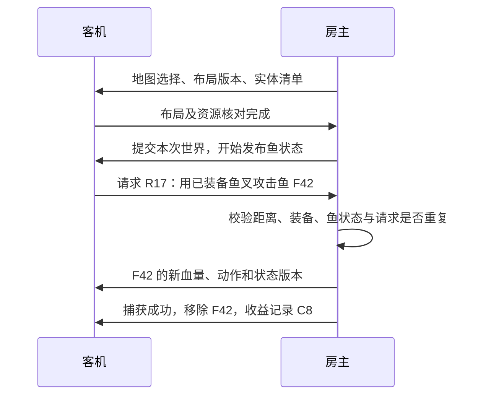

# 同一海洋、鱼与互动

当前插件源码0.1.32-dev、协议6；本轮实际Core/TCP256/256与Build警告视为错误通过（新增6项返航计划、4项提交夹具）。[员工逐项返航计划](EMPLOYEE_RETURN_PLAN.md)固定独立转换指纹并沿既有ledger一次提交；typed入仓helper已编译，无GUI/network producer，真实品质/数量政策、分流与库存增量/保存未验。证据见[构建摘要](../logs/employee-return-plan-build-verification.json)。未部署/启动，安装0.1.12、最近潜水0.1.11、默认包0.1.0保持；每人独立容量/负重、实际捕鱼/返航、客机隔离/房主世界、双端与冷配置仍待完成。

对应 PLAN 的 M4、M5 和 M6。这里区分设计、已确认的接口签名和待实机验证的行为。
已验证第二角色本地回放；0.1.5-dev 在真实潜水中运行只读鱼探针、经本机 TCP 传输实际鱼清单并执行单鱼显示组件。
0.1.7-dev 用户确认鱼可见但镜头内突然消失，日志记录角色部件销毁导致自动断开。
0.1.8-dev 没有旧异常，但用户确认标签换鱼及继续消失。0.1.9-dev 锁定身份并部署，用户确认不再突然消失。
这些证据不证明两个游戏拥有同一地图、同一条鱼或共同捕获结果。
0.1.22 历史源码为 0.1.22-dev、协议 5，插件 Build 警告视为错误通过；未部署/启动。0.1.22 该轮 Core 输入未改，复用 0.1.21 实际通过的 176/176 结果，没有重跑测试。
默认发行包保持 0.1.0，源码能力不自动进入玩家安装包。
当前安装及最近新鲜启动为 0.1.12-dev/109 项测试；加载/Update/网络入口与 4 条初始 RouteInputs 已确认，仅主菜单启动通过。
Probe、潜水路线、场景切换与正常返航仍待实机；最近完成潜水验证的是 0.1.11-dev。
用户当前不方便试玩，手动潜水 Probe/路线/返航验证已延后，保留主菜单启动通过和未验证边界。
新版单游戏 TCP 偏移鱼群可见与原鱼移除时副本同步消失已获用户确认，关闭显示后恢复正常，操作和镜头正常。
Fire/Hook/Damage 成对观察已运行；动画、完整捕获链、路线完整读取和正常返航仍待验收。
最近单鱼视觉稳定性证据来自 0.1.9-dev。
0.1.22 历史范围见 [comparer摘要](../logs/guest-comparer-build-verification.json)，插件Build警告视为错误通过；复用的0.1.21测试及该版构建见[游戏内缓存摘要](../logs/guest-ingame-cache-build-verification.json)，0.1.14历史传输见[地图选择传输摘要](../logs/map-choice-transport-build-verification.json)，已安装0.1.12-dev见[操作门禁摘要](../logs/fish-action-gate-build-verification.json)，历史潜水见[0.1.11-dev鱼群与交互摘要](../logs/fish-world-interaction-build-verification.json)，真实双游戏及真正合作捕获尚未完成。

## 世界由房主裁定

房主运行原游戏的鱼 AI、生成、伤害和收益逻辑。客机显示房主发布的状态，
发出操作请求；房主校验后决定结果。独立服务器方案仍暂缓。
这种权责划分参考 Unity 的
[NetworkObject 身份和生成权限说明](https://mp-docs.dl.it.unity3d.com/netcode/1.10.0/basics/networkobject/)，
本项目采用自己的 IL2CPP 适配和协议，尚未安装或集成 Unity Netcode。

以下为目标流程；当前地图通道仍仅传输选择候选，尚未提交共享世界或执行攻击/收益。

同步随机种子只能作为生成的一部分。两进程的加载、随机调用、鱼 AI、
玩家操作与存档条件可能不同；需要同步实际选择和最终结果，并检查布局。

## 第一层：地图选择与入海屏障

1. 建房握手后，在客机执行随机选择和异步资源加载前，接收房主的潜水场景、
   日夜条件、IGP 组和动态节点选择。生成种子可随清单发送，但不作为一致性的唯一证据。
2. 节点使用已验证稳定的地址/节点标识；路径与兄弟序号只能作为候选，
   必须检查重复、跨存档差异与两机稳定性。节点绑定有歧义时停止入场。
3. 客机从自己的游戏资源加载相同选择。未加载完成时缓冲有界消息，
   不在加载后直接改字段并假定旧地形已被替换。
4. 读取最终碰撞几何和布局清单，双方确认后由房主提交世界 epoch。
   当前 WorldLayoutReader 只完成核对框架，不会主动统一选择。
5. 切换场景、更换地图或断线时清空旧 epoch 的绑定、帧和操作请求。
   同名场景不代表相同海洋；不一致时不进入合作状态。

地图选择可能读取临时潜水数据或长期存档。接管之前必须实测哪些路径会写入进度，
建立客机临时状态和退出恢复流程，不复制房主整个存档来实现地图一致。

0.1.11-dev 的 `MapSelectionManifest` 描述入口、选中路线、层/上下连接、偏移及 IGP 预制体选择，
纯 CLR 校验/复制/排序后生成指纹；`MapSelectionCapture` 在确认的 Unity 线程读取加载后的现有字段。
所有选中路线场景必须已加载，每个场景至少观察一组选中 IGP；查找结果须与原 `CurrentIGPControllers` 注册列表一致，
并在同一管理器的两个不同 Unity 帧得到相同指纹。未满足条件时返回不可用原因，不把稳定的局部清单当完整选择。
控制器层级地址包含名称、兄弟序号和组件序号，是跨机身份候选，跨机/跨存档稳定性尚未验证。
`MAP_SELECTION` 日志明确 `PostLoadObservationOnly=true`、`HostSelectionApplied=false`。
0.1.11-dev 实机调用停在 Selected route incomplete，尚无完整选择清单；没有调用随机选择、异步加载、存档写入或加载前房主接管。

0.1.12-dev 的 `MapRouteObservation` 单独读取路线输入；只要 Transmit 开启便在入海前后最多 1Hz 运行，
不依赖 TCP Ready、完整布局或 IGP 清单已读成功。`MAP_ROUTE_INPUTS` 仅复制值变化时记录，frame 不参与变化键。
日志区分 ContextPresent、cache/roadmap 数量、first ID、cache 条目的 Selected/Loaded、候选 bSelected 层和加载场景，
并明确截断/扫描不完整/上限状态。变化键是诊断去重键，不是地图指纹或世界一致许可。
完整清单读取分别报告 cache missing、roadmap missing、first scene missing、cache incomplete（太短），返回不可用并撤销旧稳定候选。
候选选中层和加载名称不能回填为完整路线；仍要求原路线链、每场景 IGP、原注册集合一致和两帧稳定。
0.1.12-dev 主菜单启动已记录 4 条初始输入变化；尚待真实入海前后验证及完整路线采样，未接入加载前房主选图或客机进度隔离。

0.1.13-dev 新增独立 `MapRouteSelection` 与 ValidateRoute/CopyRoute/FingerprintRoute，严格共用完整 manifest 的路线校验，
保持 3..32 场景、有效文本/有限几何、唯一 ID/名称和双向全链。逐元素拥有的 CLR 副本使用 map-route-v1 指纹；完整 manifest 的 map-selection-v1 仍必须含合法 IGP，旧指纹不变。
路线与 IGP 的选择时间可能不同；已取得有效路线不构成完整世界选择。

默认关闭的 F11 Observe map selection calls 独立于 TCP/Ready/Transmit；`MapSelectionHooks` 观察五处自然边界：
cacheSelectedScenePath postfix、LoadSceneMapCacheFromSave postfix、GetRandomIGPSetInfo 的原 __result postfix、
IGPSetInfo.LoadPrefab 的 IEnumerator 工厂 prefix、SceneLoader.LoadSceneAsync(string,LoadSceneMode,bool) prefix。
确认 Unity 主线程时，在 callback 原引用仍有效的当次读取直接字段并冻结有界 CLR，不把 native wrapper/返回 handle 存入队列。
非 main 回调跳过 native 读取；全进程最多 1024 条、queue 64，CLR 日志明确空选择、RouteUnavailableReason、截断和 ReadError。
RouteFingerprint 仅路线候选；ResourceLoadCompletionObserved=false、HostSelectionApplied=false，controller address 跨机仍未验证。
factory 调用不证明 MoveNext、真实资源请求或完成，SceneLoader prefix 不证明加载完成；不能把分散边界推成所有选择先于所有加载的全局屏障。
Disconnect 关闭并卸载自己的 Observer；原方法保留自然执行，Mod 不调用或改写选图/load/save，也未共享/采用房主地图。
加载后两处 IsInitDone 使用直接 backing field，原有 Loaded/每场景 IGP/注册集合/两帧完整要求保持。
该版仅 Build/112 项核心测试通过，尚无新原生 ABI、回调时序、卸载或加载前捕获实机证据；用户当前不方便试玩，验证延后。

0.1.14-dev 的 `MapChoiceFrames` / `MapChoiceAssembler` 已将分散选择接入独立传输。协议 5 的 MapRouteSlice、MapIgpChoice、MapChoiceRetire 沿用 Room 绑定，仅 host 发布、guest 接收；地图 generation 与 choice revision 独立于场景 epoch，可在 WaitingForScene、epoch 0 时传输，不修改 Ready 或世界权限。

路线为严格 3..32 场景的 owned CLR 副本，按场景 ID 排序，每片最多 8 场景、最多 4 片；分片全部复制/校验及编码检查后，才原子取消旧待发送批次并提交新 generation。地图发送 FIFO 最多 32 包，与动作/角色/世界四路公平；控制、心跳与撤销优先。
客机接到新 generation 首片先撤销旧路线，partial Snapshot.Route=null；完整链及指纹核对后才原子提供路线，再接受连续 revision 的 IGP。同 scene/address 组按新修订更新，最多 128 组；数量或最后修订不代表完整地图/所有组已选完。
普通 SetLocalScene/场景暂停及帧清理保留 preload 候选；源观察显式失效才 Retire，Close 清 source/assembler/mailbox。溢出主动清地图队列并发控制撤销；generation 高水位保留、inactive 重复 Retire 返回 false，下一路线另开新代次。合法旧或已退休 choice 取消不关房，未来/当前冲突、畸形与错误来源拒绝。

0.1.14历史`MapChoiceController`在绑定房间后把host观察转为候选，0.1.17已替换此来源。cache/restore 每次合法样本都开新 generation，指纹相同也不沿用上一代；SceneLoader prefix 同指纹仅去重。未绑定路线的 IGP 直接 Unbound 丢弃，不缓存后补；copy 错误、Truncated、观察丢失主动撤销。已发布组再次空/unknown 返回会撤销当前候选，避免继续沿用先前非空项；未知新组空值仍 Unbound。
callbackFloor 只排除绑定/撤销前已经排队的旧观察，DTO 尚无原生 controller/context 代次证明。新 cache 边界后迟到、且 sceneName/address 相同的旧 IGP 回调仍可能附当前候选；所有 MAP_CHOICE_* 日志 NativeGenerationBound=false、CrossMachineAddressVerified=false。Scene/address 匹配和 CLR 连续 revision 均不能证明 native origin。

所有 MapChoiceSnapshot 仅为 evidence：ObservationOnly=true、HostSelectionApplied=false。0.1.14 的134项测试中包含4项实际源适配用例；Test-Core 与测试 csproj 编译实际 MapChoiceController 和 MapSelectionCallObservation，仅替代 logger，再由 synthetic DTO 与实际回环 TCP 检查分批、取消和顺序。它们不运行 NativeHook、不调用游戏入口，不是两个游戏、实际地图采用或正常返航验收。
下一步补本地 origin/代次及跨机地址证据，在实际资源加载前采用房主路线/IGP，建立客机临时进度恢复并隔离其原生生成/AI，再核对最终地形与实体后授予世界权限。不得从收到候选设置 MapAuthorityReady、GuestStateIsolated 或 M4 完成。

## 第二层：实体身份与鱼状态

- 实体身份为会话 RoomId + 世界 epoch + 房主分配的递增 EntityId。
  鱼种 TID 是种类；同种两条鱼要有不同 EntityId。
  Unity 实例 ID、内存指针和本地对象路径只用于本机诊断。
- 初始清单记录鱼种/生成资源、位置、显示方式和状态版本。
  分块传输带数量、总大小与完成校验；客机完整应用后确认，期间不接受互动。
- 初始完整状态与后续事件必须有一致的版本顺序，处理清单生成期间的新增和死亡。
  不能先接到“移除鱼”后又被旧清单复活。对象池再启用时应分配新身份或新生成代次。
- 移动和动画使用有界批次快照与插值；生成、死亡、捕获和拾取使用有序事件。
  暂定普通鱼状态 10～15Hz，最终频率、批次大小和流量以实测为准。
- 客机对应对象停用自主 AI、随机再生成和独立奖励/伤害路径。
  还要处理 Animator 根运动、群游 Job、协程与刚体，单独关闭一个组件未必足够。
  接管对象时记录本 Mod 改动，退出时恢复；避免批量停用包含玩家/地形的父节点。
- 先验证一条普通鱼；确定资源加载和副作用后再扩大到整片海洋。
  SpriteRenderer 的角色显示方案不自动覆盖 Spine/Mesh 鱼及其互动碰撞体。

## 第三层：攻击、鱼叉、拾取与结算

按用户确定的[房主＋员工、每人独立背包方案](CREW_MODE.md)，房主保留自己的LootBox，员工袋由房主Mod权威持有，各自容量/重量独立。
捕获、入个人袋、图鉴及入仓分别关联；房主袋原链返航不补Add，员工尚未入仓的物料由新增结算桥逐条确认一次进房主仓库。
员工捕获产物及更早容量检查需完整分流，不能先Add房主袋再复制；员工生存/负重适配、客机全部自动写入隔离和同层屏障均待实现。

0.1.15-dev新增`Core/Cargo`内存账本：按Member预约容量、按来源/操作/完整产物去重，未知结果保留屏障。
房主总重量不重复加产物，员工仅累加自身确认物料；返航房主原链只观察，员工每个产物使用一次派发租约并单独确认入仓/保存。
账本需要可信主机事实与完整产物计划，目前没有游戏生命周期、网络清单、员工分流、原生入仓或持久共同事务。
F11的`Observe loot and return calls (read-only)`独立于TCP，四处自然前后调用只提供CLR诊断；鱼源只在鱼prefix冻结，不猜嵌套Add/图鉴/仓库归属。
完整范围与待实机项见[员工模式](CREW_MODE.md)及[独立背包构建摘要](../logs/cargo-ledger-build-verification.json)。

客机请求携带请求 ID、epoch、目标 EntityId、动作种类、装备槽及操作时刻。
房主从已确认的玩家/装备状态计算伤害，不采用客机直接上报的伤害数或掉落数。
验证目标存活、攻击范围、冷却、动作条件及合法时刻；延迟补偿需要有界历史和明确时间窗口。
请求结果缓存并去重，同时拾取同一条鱼只有一个已提交结果。

鱼叉挂钩、QTE、拖拽和回收是多阶段动作，需要房主发放绑定/操作权，
客机先播放即时视觉反馈，再接受房主确认或回滚。确认流程不能阻塞网络线程。
先做普通鱼的伤害/捕获，再扩展大鱼、切割与特殊工具。

房主原生的 AI 可能只认识单个 PlayerCharacter。当前远程角色只有显示组件，
无法直接作为鱼攻击目标或接收碰撞伤害。需要单独验证第二玩家的目标选择、
命中代理、氧气/受伤状态及反击；不能把“鱼跟随同一路径”视为已能对两位玩家作出响应。

收益记入带唯一捕获 ID 的会话账本，由房主统一返航结算。客机只展示临时清单，
其存档写入和原游戏自动保存入口需要隔离及恢复验证。正常退出、断线和异常退出均要验收。

## 本机已确认的接口签名

Steam Build 25315876 / Unity 6000.0.52f1，读取 BepInEx 生成的互操作元数据。
这些是可研究的入口；封装方法体不能证明游戏原始控制流或安全挂钩位置。

| 需求 | 已读到的成员 | 下一步实测 |
| --- | --- | --- |
| 地图节点 | DynamicIngameNodeLoader.UniqueID / addressablePrefabName / lastSelectedData / GetSelectedAddressableName | ID 是否稳定；选取与 Init/异步加载顺序；空地址是否只是加载中 |
| IGP 组选择 | IGPSetController.CurrIGPSetInfo / CurrIGPSet / GetRandomIGPSetInfo，IGPSetInfo.prefabName / LoadPrefab | 组是否包含地形/实体；接管选择是否写临时或长期数据 |
| 鱼生成 | InGameManager.FishAllocators，FishAllocator.Spawn(bool) / OnSpawnedInstance / GetInstancedFishs | 延迟生成、Despawn、对象池与群游生成时机 |
| 鱼身份与血量 | DR.AI.FishAISystem.FishDataTID / HP / MaxHP / IsFishCaptured / FishDamageable | 初始化前读值、死亡/捕获/回收的生命周期和 HP 变化 |
| 停止本地逻辑 | FishAISystem.AddFishStopReason / RemoveFishStopReason / SetRootMotionStopped，BehaviorControlFlag，FishBehaviorTree | 停止原因所有权、物理/群游/协程是否仍运行及恢复副作用 |
| 伤害 | Damageable.TakeDamage(AttackData)，SABaseFishSystem.OnTakeDamage / OnDie，Damager.GetAttackData | 真正裁定点、调用链、重复奖励及原生异常路径 |
| 鱼叉与捕获 | CatchableObject.HookedByProjectile / WinFromProjectileinFight / SetDieState | 鱼叉绑定、QTE、捕获记账及销毁顺序 |
| 拾取 | FishInteractionBody.SuccessInteract / SuccessPickupFish，PickupInstanceItem.SuccessInteract / OnStoredItem | 权限与收益在哪一层提交、两人竞争时的原子操作 |
| 临时进度 | IngameSaveDataManager.SaveInGameData / GetInGameData | 适用的数据类型和客机退出恢复；尚未调用写入方法 |

可复现签名研究：`development/scripts/Inspect-WorldApi.ps1`。
报告保存到忽略的 `.local/analysis/world-api.json`，不发布游戏程序集或完整机器记录。

## 地图加载前入口研究

四份历史世界日志共 173 条快照、0 个探针错误，DynamicIngameNodeLoader 在这些采样中均为零；
实际观察到的是添加场景中的 IGPSetController。相同 `A03_01_02` 入场在不同会话使用不同 IGP，
并分别添加 `B03_02_02`、`B06_02_02`，因此路线清单必须覆盖整个 A/B/C 场景及对象组选择。

SceneContext 的 `BuildMapLayerData`、`LoadSceneMapCacheFromSave`、`cacheSelectedScenePath`，
以及 `GetSelectedMapLayerCached` / SceneMapLayerDataCache 的 SceneID、SceneName、LayerChar、连接字符串、
高度和加载状态，是路线观察候选。`IGPSetController.GetRandomIGPSetInfo()` 返回 IGPSetInfo，
而 `DynamicIngameNodeLoader.GetSelectedAddressableName(bool, out int)` 返回 void，地址在实例字段中。
Init/LoadPrefab 返回 IEnumerator，观察工厂返回不等于异步加载完成；应结合初始化和实例加载状态。

IGP 还有 `saveDatatype`、`ISaveableInstanceData` 及 `StoreUsedInstacneID(string)` 路径。
客机进度隔离不能只覆盖 IngameSaveDataManager。尚未改写这些选择或保存入口；
选择候选传输已接入；下一步补真实调用顺序与 native origin/代次及跨机组标识证据，再实现加载前实际采用和客机临时状态/生成/AI 隔离与布局确认。
可运行 `scripts/Inspect-MapEntryApi.ps1` 复现元数据签名；签名不能证明原始控制流或存档副作用。

## 只读探针（0.1.4-dev 引入，0.1.5-dev 已实机读取）

F7 切换 Discovery.EnableWorldProbe，默认关闭。开启后每 2 秒在 Unity 主线程读取
活动管理器、节点选择、IGP 组、分配器、鱼的种类/位置/HP/捕获/死亡状态与物品。
不调用生成、伤害、捕获、拾取、停止 AI 或存档写入方法。
每条记录最多观察 256 条鱼、128 个物品、256 个分配器、128 个节点和 32 个 IGP 组，
报告截断集合与总查找数量。每进程默认最多 900 条快照，配置限制为 1..1800，另有 32 MiB 上限；
重开开关不会重置进程限额。失败点写入记录，日志文件失败则停用文件观察。

标记为 DAVECOOP_WORLD_PROBE_READY / WORLD_LOG / WORLD_STATE / WORLD_WARNING。
原始 JSONL 放在游戏插件 logs/world-*.jsonl，只保留机器本地。
首次实测按顺序观察：入海加载、移动到新区域、房主捕鱼/拾取、返航、第二次入海。
核对节点选择何时稳定、每条鱼的初始化/死亡/销毁过程、延迟生成与 ID 复用。
本次 A03_01_02 潜水取得 72 条快照，无读取错误；分配器与物品集合按上限截断，不能把它们当作完整世界清单。
观察到 4 条本机鱼的 HP 变化及 3 条挂钩状态样本；没有死亡/捕获样本，短命状态和池复用仍需事件验证。

## 实体通道（0.1.5-dev 已验证单游戏实际鱼传输）

Core/World 的 HostEntityRegistry 将本机对象 token 映射为房主分配的 ID，
同种鱼不同 ID；明确释放后复用 token 分配新 ID，同 epoch 清空也不会复用旧 ID。
新 epoch 清空绑定；房间和 epoch 来自已确认的会话，不发送 Native 指针或本机实例 ID。

当前协议 5 保留历史协议 3 引入的 WorldSlice：最多每块 16 个实体、每快照 4096 个实体。
快照携带 epoch、场景、递增修订和采样时间，含类型/TID、姿态、HP/MaxHP、死亡与捕获状态及可选显示描述。
每块降至 16 个实体以容纳显示字段的合法最大值，保持 128 KiB 消息限制；双方版本必须匹配。
检查数值、种类、数量、唯一 ID、分块顺序和一致的头部；完整收齐后才移交客机主线程。
接收端允许新修订的首块替换未完成旧修订，保留已提交状态；空快照可表达清单清空。
发送端完成已开始的整批清单，仅保留下一批最新状态；两批有界缓存避免持续采样让慢连接一直无法提交。
尚未开始的批次可替换。出站动作 FIFO、玩家移动、世界切片和地图 FIFO 四路公平轮转，控制/心跳与撤销优先；入站世界只保留最新完整快照。
禁止客机发布世界、禁止旧本地快照被改标为新 epoch，场景暂停/重载/关闭时清理缓存。

0.1.20 历史核心总计 174/174 通过：实体测试覆盖身份/池复用/容量、畸形数据、原子拼装与复制所有权、
修订更替/空清单、权限/epoch、容量/公平性、真实 TCP 数值清单/HP 更新/移除及旧协议拒绝。
测试为 CLR 夹具；没有在两份游戏中调用捕鱼或物品 API。

Native FishStateCapture 在房主的 Unity 线程最多 5Hz 读取玩家所在场景的已初始化鱼，
发布数值观察及可读取的显示描述。F11 勾选 Transmit read-only fish observations 后启用，默认关闭。
Local test 的内部客机会经过真实 TCP 接收完整清单，或由另一台客机接收；
WORLD_RECEIVED 最多每 2 秒记录数量/修订，NETWORK_STATE 同时记录本地观察与远端数量。
完整读取和验证后先清理旧绑定再分配新 ID，避免读取失败积累半批绑定。
原生读取失败只记 WORLD_CAPTURE_WARNING，不发布该批清单。

本次单游戏本机 TCP 收到 59 条鱼清单概要，数量 12..21、最大修订 582，读取/资源解析无警告。
0.1.5-dev 可另开一条鱼的显示诊断，客机鱼 AI、地图及收益尚未接管；
只包含当前场景的已初始化鱼，物品读取、生成事件及跨场景实体仍需接入。
轮询可发现已观察到的销毁/失活、指针或鱼种变化，
同种池对象在两次轮询之间关闭再启用，通过下述生命周期代次分配新身份；已观察原生回调，但实际池复用身份和全部鱼类覆盖仍待实测。
完整数值快照也不能捕获两次采样之间生成又消失的短命对象，后续需有序生命周期/互动事件。

## 收到的完整活动鱼观察清单显示（0.1.11-dev 可见与移除同步已确认）

F11 新增默认关闭的 `Display received fish roster (display only)`；本机 TCP 测试还须开启
`Transmit read-only fish observations`，客机接收房主已发布的完整清单。
`FishWorldBuffer` 对一批完整数字清单原子新增、更新和移除，每个鱼 ID 独立保留最多 16 帧；
旧 epoch/修订和无新身份的鱼种变化拒绝，空清单清空，缺 Visual、死亡/捕获仍保留清单中的数字条目。
镜头不参与清单身份；一秒未收到新清单隐藏显示，更新恢复后沿用身份，epoch/场景/断线清理。

`RemoteFishWorld` 通过共享 `FishDisplayNode` 为收到的活鱼创建自有 SpriteRenderer 或 SkeletonAnimation。
本机测试向右偏移 3 个单位并着淡蓝色；镜头外隐藏节点但保留身份和历史。
暂缺显示/源不可见/未知资源只隐藏相关显示，单鱼显示异常隔离；清理仅销毁自建节点，原鱼 AI/碰撞/奖励保持原样。
Spine 源主动画变为 null 时清理自有轨道并恢复 setup pose；多轨、混合、特殊材质/约束和非 Spine Mesh 仍未覆盖。
0.1.11-dev 实际 A03_01_02 本机 TCP 已记录 49 条 Ready 概要、53 条 FishWorld 状态，
观察/绑定/可显示/可见最大 16、网格顶点 662，未知/缺 Visual/显示错误为零。
用户确认成对偏移鱼可见，捕获原鱼时对应副本也消失，关闭 Display received fish roster 后恢复正常，操作和镜头正常。
Local test 保留原鱼加偏移诊断副本；同步消失是清单移除显示同步，不是捕获副本、客机 AI 接管或统一世界完成。
动画、进入/离开镜头和正常返航清理仍待确认；用户确认主动退出且未返航。

`FISH_WORLD_STATE` / `FISH_WORLD_TRANSITION` 的状态日志分开记录：收到实体总数、收到鱼总数、活鱼数、
可解析显示、组件开启、镜头内、未知资源、缺 Visual、源不可见、实际自建节点、网格顶点与显示错误。
`NETWORK_STATE` 提供 FishWorldReceived/Alive/Renderable/Visible/InView/UnknownResource/MissingVisual/Nodes/Status 等概要。
完整接收仅指房主玩家当前 scene 的活动已初始化观察集合，不含其他已加载层的鱼、完整物品或所有短命生成事件。
数字清单缺席可能表示停用而非永久销毁；这些副本不可捕获，不代表客机鱼群 AI 接管或 M4 完成。

## 一条鱼的显示诊断（0.1.9-dev 已确认可见与身份稳定）

FishVisualCapture 优先读取鱼的 SpriteRenderer，否则读取 FishSpineAnimator 或 SkeletonMecanim。
已确认的本机接口来自生成的 spine-unity.dll，未安装或升级 Spine。
可复现签名读取：`development/scripts/Inspect-FishRenderApi.ps1`，输出到忽略的 .local/analysis。
其组件与动画概念可参考 [Spine 官方 Unity 组件说明](https://eu.esotericsoftware.com/spine-unity-main-components)。
Mecanim 以主层权重最高的动画片段名称寻找骨骼动画；名称对应关系参考
[官方开发者说明](https://en.esotericsoftware.com/forum/d/29724-unity-animationclip-renaming-issues-and-editing-conflicts-in-skeleton-mecanim/7)，
本机实际名称和片段时长仍待观察。

显示描述包含资源键、相对姿态、颜色/排序/朝向，以及 Spine 的皮肤、主动画、采样时刻和缩放。
Sprite 使用已有 SpriteKey；SpineCatalog 使用骨骼资源名、缩放和图集名序列生成 spine-v1 元数据哈希。
哈希不包含像素或资源 GUID，跨机稳定性待验；同键不同本机资源标记歧义并拒绝显示。
资源注册与查找在 Unity 线程；网络只传 CLR 数据，不上传本机资源引用或游戏资产。

RemoteFishPreview 保留一个收到的鱼 ID，使用最多 16 帧进行姿态插值；清单移除后清理或选择另一条鱼，
一秒未收到新状态便隐藏，epoch/场景/断线变化清空。Sprite 显示创建自己的 SpriteRenderer，
Spine 显示创建自己的 SkeletonAnimation，关闭自动更新并按收到的主动画时间手动更新显示。
不复制 FishAISystem、碰撞体、伤害、拾取或存档组件；清理仅销毁自己创建的节点。
0.1.5-dev 原生初始化与资源解析已执行，59 条状态记录组件启用、未知资源为零；0.1.6-dev 用户仍未能辨认预览。
0.1.7-dev 用户确认带标签鱼可见，但稳定性失败；44 条清单概要、42 条镜头内状态和两次自动断开见 `../logs/native-fish-preview-verification.json`。
0.1.8-dev 修复本地角色临时显示部件销毁导致会话断开的路径，实机射击恢复、动画/转向及正常清理待确认。
0.1.7/0.1.8-dev 每批重新比较距离，实机编号 11→18→3→15→18→20；用户确认标签跳鱼。
0.1.9-dev 仅初选/合法替换/手动重选时选镜头内最近鱼；已选 ID 仍存活且在清单内时保留，即使更远、镜头外、暂时不可见或显示描述缺失。
镜头只决定显示，不决定身份释放；死亡/捕获/清单移除仍按房主状态换到合格替代鱼，F11 可按 Select nearest preview fish 主动重选。
清单当前只表示活动观察集合，缺席可能是停用而非永久销毁，不能据此宣称完整客机世界生命周期已接管。
本机副本仍偏移 3 个单位，镜头资格按偏移后位置判断，并加蓝色十字与 MultiDave Fish Preview 标签。
日志增加 FishPreviewInView 和 FishPreviewMeshVertices，以区分组件启用、镜头内和实际生成骨骼网格；标签/网格与动画都需实测确认。
本次探针鱼的 Sprite 部件为零、Mesh 部件最多一个，Sprite 鱼路径尚无独立实机覆盖。
主动画路径不覆盖混合、多轨、槽位材质、
自定义骨骼约束或非 Spine Mesh；未知显示资源隐藏，数值鱼状态仍可传输。

实机验证步骤：

1. 正常保存退出后部署当前开发版，重新启动并核对本次加载版本及构建哈希。
2. F11 点击 Local test，勾选 Transmit read-only fish observations 和 Preview one received fish，关闭面板入海。
3. 核对 WORLD_RECEIVED 数量/修订、NETWORK_STATE 的 UnresolvedVisuals/FirstVisualError、
   FishPreviewEntity/Visible/InView/MeshVertices/UnknownResource；观察带 MultiDave Fish Preview 标签的鱼及其动画和转向。
   仅看到标签时应继续排查网格、材质与排序，不能标记鱼显示已通过。
4. 捕获原鱼后观察显示移除或换鱼；Disconnect、返航、再入海均应清理，保持玩家操作与镜头正常。
5. 对照 F7 探针记录实际鱼生命周期；再在两份游戏中核对资源键和显示。

两个诊断选项均默认关闭。该测试保留原生鱼群，仅验证收到的数据能显示，
不能作为 M4 的客机世界接管或 M5 合作捕鱼验收。

0.1.9-dev 新增 FISH_PREVIEW_SELECTION，带原/新 EntityId、epoch/revision 和更换原因；
FISH_PREVIEW_TRANSITION 记录 Visible/OutsideCamera/SourceInvisible/MissingVisual/Stale/未知资源等即时状态，每控制器最多 2048 条。
NETWORK_STATE 同时给出 FishPreviewStatus/SnapshotAge；两秒概要无法排除短暂隐藏，实测以即时状态和玩家反馈核对。

## 0.1.6-dev 对象池生命周期观察

FishLifecycleHooks 使用当前框架自带的 HarmonyX，观察 FishAISystem OnEnable、
FishAISystem/SABaseFishSystem OnDisable，及这两个类和四个特殊鱼子类的 OnDestroy，共 9 个声明方法。
这些前缀只读取互操作包装器指针并写入 CLR 跟踪器，不跳过原方法、不写鱼状态、不在回调中调用 Unity 或记录日志。
挂钩与卸载方式参考 [HarmonyX 官方说明](https://github.com/BepInEx/HarmonyX/wiki/Patching-with-Harmony)，
IL2CPP 后端机制参考 [Il2CppInterop 官方实现](https://github.com/BepInEx/Il2CppInterop/blob/master/Il2CppInterop.HarmonySupport/Il2CppDetourMethodPatcher.cs)；
游戏原始方法与对象池的调用顺序仍须实测。

只在房主开启鱼观察且准备发布状态时安装，未观察对象的回调不分配记录，容量仍为 4096。
关闭诊断或断线先停用本插件观察，再调用 UnpatchSelf，只卸载自己的挂钩；场景切换清空跟踪状态。
回调异常不会传播到原游戏，而会停止鱼状态发布；部分安装失败会停用观察并尝试撤销自己的挂钩。
FishLifecycleTracker 对停用/启用及销毁/地址复用生成单调代次，嵌套基类/子类回调幂等处理。
HostEntityRegistry 发现代次变化便分配新 EntityId，同种、同指针的池复用不沿用旧网络编号。
采样只包含启用且活动的鱼；回调丢失后的失活/重新观察也会分配新代次。

5 项核心用例覆盖采样间完整池循环、重复回调、销毁/地址复用、未知回调容量、清理及并发。
0.1.6-dev 已在真实潜水记录安装成功及已跟踪鱼的回调变化，无回调错误。
这还不能证明原生池重新启用的完整覆盖或卸载/返航恢复；应继续实测。
实测应核对 DAVECOOP_FISH_LIFECYCLE_READY、NETWORK_STATE 的 FishLifecycleHooks/Tracked/Transitions/CallbackErrors，
捕获/离场后的代次变化、关闭鱼诊断/Disconnect、返航和第二次入海的恢复行为。
0.1.7-dev 另记录 FISH_LIFECYCLE_STOPPED（自己的挂钩注册已移除）和 NETWORK_DISCONNECTED（会话与自己显示已清理）；
这些标记仍须结合后续帧、实际操作和返航日志验证恢复。

## 鱼叉同步入口仍待实现

0.1.10-dev 增加本地 HostEntityTarget / HostEntityRegistry.TryResolve(epoch,id)，返回只读 token、种类、TID 和代次。
绑定替换、解绑、清理和新 epoch 撤销旧反向记录；同 epoch 清理不复用编号，断房间才重置身份表。
FishStateCapture.TryResolveNativeFish 仅在 Unity 线程使用，重新核对当前包装器指针、实例编号、TID、场景及活跃生命周期代次。
0.1.11-dev 已部署启动，并在发射/挂钩/伤害观察的消费时复核相关原生目标；QTE 胜利及入袋的完整覆盖仍待实测。
这只证明目标身份：操作还要核对会话权限、鱼状态、装备/距离/冷却和唯一请求，不缓存查询值作为后续授权。

0.1.11-dev 的 `ObservedHostTargets` 在主线程发布最多 4096 条冻结的本地指针→房主身份 CLR 快照。
回调仅用该快照及线程安全生命周期代次查询，不访问 Unity 对象，也不将本机指针/token 放进网络。
`FishInteractionHooks` 默认关闭，只在房主开启 Transmit 与 Observe host harpoon and fish interactions 时安装。
8 个声明方法为鱼/特殊鱼的 OnTakeDamage 两项、鱼 HookedByProjectile、鱼及两种 Mahoni 的 QTE Win 三项、
鱼 SuccessPickupFish 和 HarpoonProjectile.Fire；prefix/postfix 保留原方法执行及返回值。
prefix 生成 CallId 并固定当时 epoch/EntityId/代次绑定，postfix 复用同一绑定，避免消费时按已复用的指针误绑新鱼。
只有伤害的原 bool 返回被按值记录；它不等于捕获结果。`HpAtDrain` 是主线程消费事件时的 HP，
两条前后日志的 HP 可能都已更新，不能计算本次伤害差；`NativeOutcomeConfirmed=false` 明确限制。
投射物 Fire 不含鱼目标，未观察到的鱼也可能没有绑定；这是本机调用观察，不是跨机发射/命中事件。

事件队列最多 4096、待配对调用最多 1024、每进程最多接受 8192 条观察，消费每帧最多 512 条。
核对 FISH_INTERACTION_READY / INTERACTION / WARNING / STOPPED、配对/绑定/丢弃/线程与回调错误，
关闭/断线仅卸载自己的注册并丢弃本地队列。
本次已健康安装 8 个入口，42 条事件对应 21 对 CallId：HarpoonFire 28 条、FishHookedByProjectile 10 条、
FishDamage 与 SpecialDamage 各 2 条，两个原 bool 为 true。两种伤害声明及 __state 配对在该实机路径已观察。
相关 prefix 绑定固定，14 条事件消费时有可用原生目标，回调/解析/未配对/原生查询错误为零。
未见 Win 或 Pickup；原 bool 和用户看到原鱼/副本同时消失不能证明完整捕获链或合作裁定。
已记录 FISH_INTERACTION_STOPPED / NETWORK_DISCONNECTED，正常返航恢复仍待验收；用户确认主动退出、未返航，正常返航保存仍未验证。
没有由 Mod 调用伤害、捕获或记账入口；0.1.12-dev 已准备请求去重与权限门禁，实际原生裁定及收益账本仍待实现。

## 操作请求与只读目标检查（0.1.12-dev 启动通过，目标检查待验）

`FishActions` 定义 ProbeTarget、FireHarpoon、FireGun、SubmitQteInput、RecallHarpoon、RequestPickup。
请求只包含意图编号、玩家、epoch/scene、房主目标 ID、装备槽/版本、数值输入及 interaction；
不携带 damage、收益、原生包装器/指针或 generation。房间来自外层 envelope，真正来源来自握手绑定玩家。
规范指纹覆盖所有请求字段，场景长度前缀、浮点规范格式及正负零统一；它不是认证凭证。

协议 4 新增独立请求/结果 FIFO。host 接收请求固定绑定 guest，guest 只接受自己 outstanding 请求的完整元数据/指纹匹配结果，
拒绝未请求、冒充、冲突或原生 operation 回退。动作不放进覆盖为最新值的角色/世界邮箱；控制/心跳优先，再公平轮转动作和数据。
合法 pause/场景切换期间，旧请求或结果发布在会话锁内返回 false，不把正常的失效竞态当协议错误断房；GUI 发布异常被捕获。
`HostFishActionGate` 最多 16 pending、1024 终态缓存，独立突发/速率预算；有效新 ID 即使业务拒绝也推进房间内高水位。
同键同内容返回已有阶段/结果，同 ID 改内容为冲突；旧 ID 无缓存为 ReplayExpired。换 epoch、清理场景和缓存淘汰不重置该屏障。

主线程读取最多 0.25 秒的新鲜权限 facts；请求到达最多一秒。ProbeTarget 只核对当前原生鱼身份/代次、scene 和终态。
真实动作额外要求 MapAuthorityReady、GuestStateIsolated、LocalActorArbitrated、可信 actor/loadout、资源/冷却、空间/阶段及 native capability 全部可用。
本版这些 effect 事实仍 false；客机坐标、选中鱼、原伤害 bool 或房主本地装备不能填补缺失能力。
纯 CLR 候选计划持有短租约，派发前用更新的 facts 重查目标代次、玩家/装备版本，先标记 Dispatching；没有本版原生 effect 调用。
明确未进入才释放预约；已进入但不确定为 OutcomeUnknown，不再派发，不凭超时当作无副作用，当前保留预约到关房。
房主本地竞争只有显式 capability 前置项，尚未接入实际全游戏裁定；CLR lease 不能证明双方捕同鱼没有重复收益。

F11 的 Check selected fish target 在 Guest 或 Local test 的 Ready/已选单鱼条件下发 ProbeTarget；
host 主线程重新 TryResolveNativeFish，并复核冻结身份和捕获/死亡状态，通过只返回 DryRunValidated、OperationId=0。
状态读取前后复核 lifecycle 健康与代次，变化则撤销该次身份；同 epoch 开关观察保持世界 revision 单调。
`FISH_ACTION_SENT` / ADMISSION / DECISION / RECEIVED 显示请求/结果及 NativeEffectsEnabled=false；未解析的目标明确拒绝。
这个按钮只验证请求往返与有效目标，不发射鱼叉、不扣血或捕获。当前 174 项核心测试及三种 TCP 操作夹具（往返、旧协议拒绝、take 后场景切换恢复）通过，不证明两个游戏或 M5 成功。
0.1.12-dev 的新版 Probe 与真实游戏场景切换仍未执行验收；主菜单启动和初始 RouteInputs 不能代替这些行为。

可复现元数据研究：`scripts/Inspect-FishInteractionApi.ps1`。确认鱼自身覆写 HookedByProjectile(ProjectileInfo) 和 WinFromProjectileinFight，
不能只观察 CatchableObject 基类便认定覆盖鱼。HarpoonProjectile.Fire(Vector3) / CollisionDetection(GameObject,Vector2) 与 HookedObject
提供投射物和实际鱼目标候选；Damageable.TakeDamage(AttackData) 与 Damager.DoDamage(Damageable) 返回 bool。
Damager.GetAttackData 是 ref-return 属性，首轮宜观察原参数/字段，不把它当普通返回方法挂钩。

捕获收益至少分为 FishAISystem.SuccessPickupFish、LootBox.Add、SaveDataCaughtFishRouter.AddCaughtFish 和 IngredientsStorage.AddFromLootBox。
QTE 胜利、捕获、入袋、图鉴与返航入仓须分别验证，不能由单个标记推断整个结算；这些写入入口尚未调用。

用户此前观察第二个戴夫没有发射鱼叉。当前角色帧只包含显示姿态与部件；协议 4 已有发射意图的请求模型，但没有可执行发射桥、独立投射物事件/状态或真实伤害许可。
后续需给每次发射分配会话/epoch/投射物 ID，同步鱼叉飞行、命中、QTE 绑定及回收，
并由房主验证装备/攻击条件和裁定鱼的血量、捕获与收益。不能给显示副本直接启用原生武器，避免单例、命中和奖励重复执行。

## 验收顺序

离线原生分析已发现`coLoadAdditiveScene/CoLoadSceneAsync.MoveNext`直接调用
Addressables五参LoadSceneAsync，绕过当前SceneLoader三参观察；不能声称现有观察覆盖全部请求。
需要工厂/每次MoveNext的固定owner及显式子协程继承，关联typed操作指针/版本→实际Scene句柄→controller寿命。
cacheSelectedScenePath与IGP.Init还含持久缓存/实例保存目标，地图采用须共同隔离客机状态。
详见[NATIVE_ANALYSIS](NATIVE_ANALYSIS.md)。0.1.16已接默认关闭的加载来源只读adapter，具体fixed scope、typedoperation→Scene/controller、限额与撤证见[MAP_ORIGINS](MAP_ORIGINS.md)。
本轮6组synthetic registry夹具通过，未部署/启动或运行原生挂钩；完整来源与原生ABI/加载时序仍待验证。
0.1.16历史adapter尚不接网络MapChoice generation；0.1.17另接当前CLR清单，不修改原选择，原生代次、客机采用与世界权限仍false。

1. 只读探针验证真实对象和加载顺序。
2. 两份游戏使用不同本地存档/入海条件，仍按房主选择得到相同布局。
3. 同一条普通鱼在两端出现、移动和消失，客机没有重复的自主鱼。
4. 客机攻击后房主扣血，两端显示同一结果；重复请求与同时捕获不增加收益。
5. 普通鱼能对两位玩家响应；断线和场景切换没有残留接管或错误奖励。
6. 完成双人入海、合作捕获、房主返航结算、客机临时状态恢复，再验证冷配置并发布。

## 0.1.17 当前接线与下一桥

0.1.17 将当前固定来源 CLR 清单接入候选发送：建房时记录实际 Run/owner floor，建房前 entry、退休 Run/owner/controller 和旧回调不能提供新来源。集合删除或替换先退休旧 wire 代次再重发，每帧最多 8 条选择；诊断队列消费不影响当前清单。旧 Observe map selection calls 仅诊断，其关闭或丢失不发送/撤销来源。

新增 6 组 Core 快照和 6 组实际回环 TCP 适配测试，原 4 项源适配已迁移，总计 160/160 通过；Build 警告视为错误通过。测试使用合成标量，不运行 NativeHooks、NativeCapture、Unity provider 或两个游戏。NativeGenerationBound、HostSelectionApplied、GuestStateIsolated、WorldAuthority、CargoAuthority 仍为 false；未部署或启动。

当前行为见[固定来源候选传输](ORIGIN_MAP_TRANSPORT.md)和[0.1.17 构建摘要](../logs/origin-map-transport-build-verification.json)。0.1.14 的 callbackFloor/cache 来源与 0.1.16 的“仅日志”是历史范围，当前发送流程按新文档执行。

客机的原生 Serialize/Deserialize、双 Data/Interaction 根及直接恢复候选已离线定位，见[客机影子桥研究](GUEST_ISOLATION.md)。SaveData(string ver) 不是 JSON 构造器，SetLoadedData/Load 不是纯交换；旧协程、缓存、可变子树及全部持久输出仍需隔离与恢复验证。尚未执行原生克隆/根替换或证明 GuestStateIsolated。每人的独立容量和负重规则保持不变。

## 0.1.18 原生根桥与输出围栏源码

0.1.18新增实际typed原生影子桥、单次事务及已枚举输出围栏源码。四类Data原生JSON round trip、五根直接交换/回读/恢复和15个独立强handle已编译；7组新增事务夹具以合成backend验证partial/unknown补偿、fence/refs保留和一次清理，总167/167通过。

当前生产进入与静止边界恒false，事务在围栏安装前拒绝；startup primitive自身再查边界，未接Network/GUI，未运行克隆、根交换、阻断或恢复。194条精确声明不是所有writer、独立native地址或ABI证明；Interaction未Sync、完整子树/旧缓存/协程隔离仍待完成。全部GuestStateIsolated/NativePermission/WorldAuthority/CargoAuthority保持false，未部署或启动。

实现与下一步见[原生根桥](GUEST_SHADOW_BRIDGE.md)、[输出围栏](GUEST_OUTPUT_FENCE.md)及[0.1.18构建摘要](../logs/guest-shadow-build-verification.json)。下一步必须实现可信原生进入/静止边界与缓存/Interaction切换，再进行受控实机验证；个人袋分流、真实地图采用及双游戏闭环仍按原计划推进。

0.1.20 已将[独立食材缓存准备/恢复](GUEST_INGREDIENT_CACHE.md)接入第六步源码，174项测试仅覆盖CLR控制及此前范围；[当前摘要](../logs/guest-ingredient-cache-build-verification.json)不证明原生运行。每人独立容量/负重及房主唯一长期收益规则保持；完整资源、缓存、真实地图、捕鱼分流、返航和双游戏仍待验收。

0.1.21 新增第七[游戏内临时缓存](GUEST_INGAME_CACHE.md)，六record的[精确API](GUEST_INGAME_API.md)只支持已覆盖子图，非空助手资源/live设备队列明确拒绝。三known baseline在Serialize前捕获闭合，准备后strict重查；逆序7→6→五Save根，上限21explicit handles/4Data stamps，第七单field不得Mixed。ordinary record exactclass/object_new候选未执行，176项Core测试不证明统一海洋或native隔离；[该版摘要](../logs/guest-ingame-cache-build-verification.json)的插件Build警告视为错误通过。

## 0.1.22 comparer 候选仍不授权统一世界

[独立comparer合同](GUEST_DICTIONARY_COMPARERS.md)与[精确API](GUEST_COMPARER_API.md)覆盖三key int/string/InGameSaveType(int32)的已核Generic/Object及该enum专用Enum同class独立候选。原pointer/class/kind和aux纳入审计，Ingredients同规则；null原可Capture但Prepare拒，不调用Default/CreateComparer/getter猜选择、不共享或清空，custom/文化/hash-salt未知拒绝。新表显式(capacity,comparer)先于Add；constructor抛时assignment未发生，PartialConstructorAllocationRetentionVerified=false。

七步/21explicit handles/4Data stamps未扩，全部ABI/fullisolation/entry/quiet/native/guest/world/bag权限false，无GUI/Network自动native入口。[0.1.22 历史摘要](../logs/guest-comparer-build-verification.json)的Build警告视为错误通过；0.1.22 该轮 Core 输入未改，复用0.1.21实际176/176，未新跑。[冷档候选](GUEST_COLD_PROFILE.md)只研究首load/slot/output而未采用。继续资源/actor/cache/output与实际边界、房主加载前地图采用、每人独立袋/容量/负重下的真实捕获及逐产物返航、实际双端和冷配置，完整M3—M7不变。

当前entry/quiet/native/guest/world/bag权限均false。M4仍需真实房主选择采用与客机生成/AI/资源/actor/余下cache和输出隔离；M5/M6仍需按个人袋容量分流、完整真实捕获产物及正常返航一次入仓。每人独立容量/负重和完整M3—M7、真实双端与冷配置验收继续保留。
